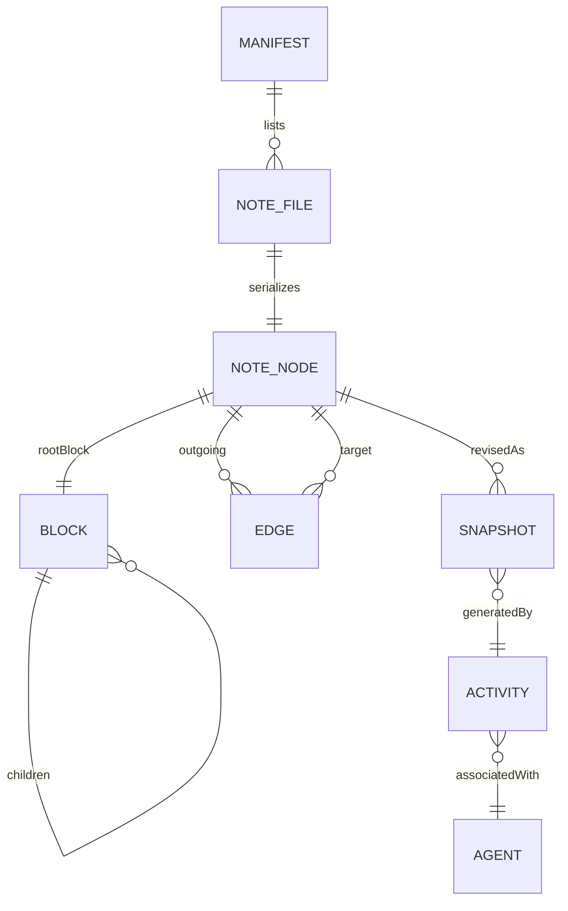
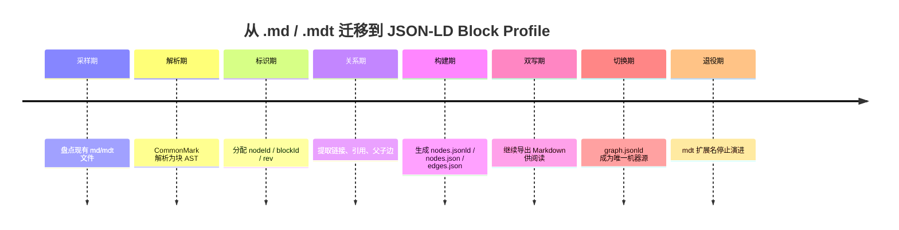

# FeroHa JSON-LD Block Model 技术手册

## 执行摘要

结论先行：**不建议继续把 MDT 发展为一个新的正式文件格式**。对 FeroHa 而言，更稳妥、工程成本更低、长期兼容性更强的方案，是把内部知识图谱的**源格式**切换为“**JSON-LD + 自定义 Block Profile**”，把 Markdown 降为**派生展示层与导出层**。JSON-LD 已是 W3C Recommendation，可用 `@context`、`@id`、`@type`、`@graph` 表达图数据，并可通过 **Framing** 把同一份图数据重组为应用需要的树形布局；这正好覆盖了你原先希望 MDT 同时承担的“图 + 树 + 机器可读 + UI 可渲染”四个目标。citeturn3view0turn9view0

从格式语义上看，JSON-LD 还有两个对 Block Model 非常关键的优势。其一，JSON-LD 文档本质上是 RDF dataset 的 JSON 序列化，因此“节点—边—属性”的表达是原生能力，不需要再为知识图谱另造一套边表语法。其二，JSON-LD 中**普通数组默认无序**，而 `@list` 明确表示**有序值列表**；这意味着块树的 `children`、行内片段的 `runs`、表格行列等顺序敏感结构，都可以得到严格语义保证。citeturn3view0turn7view5turn7view6turn8view2

因此，本手册的最终建议是：**MDT 可以保留为概念名，但不再作为新扩展名推进**；FeroHa 的正式持久化模型改为 **FeroHa JSON-LD Block Profile**。在这个方案里，`alpha / beta / gamma` 不再承担“编码边”的职责，而仅作为 **Reader 检索、折叠、上下文展开、Agent 调度** 的优先级元数据；跨区域连接、引用、父子关系、语义关联必须全部使用**显式 edge** 表示，而不是“数值相加”。这与 RDF/JSON-LD 的图语义、以及 Framing 负责视图布局而非改写底层事实的做法是一致的。citeturn5search1turn5search16turn9view0

在实现层面，本手册建议采用**文件系统优先**、**每个知识节点一个 `.jsonld` 文件**、**构建期导出聚合 `graph.jsonld`** 的模式；同时维护 `nodes.json`、`edges.json` 和可选 SQLite/FAISS 缓存。这样既保留 Git 友好性，又避免单一大文件成为合并瓶颈。JSON Schema 用于文件级形态校验，SHACL 用于图级约束校验；Markdown 则以 CommonMark 为基础导出目标，表格与任务列表走可选 GFM 扩展。citeturn3view1turn3view8turn20search0turn20search2turn4search2turn21search0turn21search1turn3view10

## 替换原则与总体架构

### 替换原则

这次替换的核心，不是“把 `.md` 改成 `.jsonld`”这么简单，而是确立一组**不丢语义、可回退、可验证、可扩展**的替换原则。

第一条原则是**单一事实源**。JSON-LD 负责保存机器语义、块树、图关系和审计线索；Markdown 只作为导出物存在，不反向定义源语义。这样做的依据是：JSON-LD 既是 JSON，又能序列化 RDF dataset；Framing 还可以把图按指定树布局输出，这已经覆盖了“内部存图、外部看树”的双重需求。citeturn8view2turn9view0

第二条原则是**显示层与存储层分离**。块树是给 Reader 与 UI 用的；显式边是给检索、导航、推理和回溯用的。不要再尝试让 `alpha/beta/gamma` 兼任“边编码”，因为图里的关系应当一等表达，而不是隐含在坐标运算里。RDF 的核心抽象本来就是 subject–predicate–object 的 node-arc-node link；JSON-LD 则是这种图模型的 JSON 序列化。citeturn5search1turn5search16turn3view0

第三条原则是**顺序显式化**。块树、段落 runs、列表项、表格行列，全都要使用 `@list` 语义或等价的有序序列约束。因为在 JSON-LD 里，普通数组默认不代表有序集合；只有 `@list` 才表示有序值。citeturn7view5turn7view6

第四条原则是**标准词汇优先，领域词汇补充**。通用元数据尽量复用 schema.org 与 PROV-O；FeroHa 专属语义单独放在 `fh:` 命名空间，而不要误用 schema.org 的 pending/meta 词汇。schema.org 官方文档明确说明 vocabulary 可扩展，但 pending/meta 具有变动性或并非面向一般公开使用。citeturn17search6turn27search7turn22search1turn24view0

第五条原则是**本地 context、冻结版本、远程只作构建输入**。JSON-LD 允许 remote context、`@import` 与相对 context，但 W3C 也明确提醒：从 Web 加载的远程 context 在非安全连接上可能被篡改，依赖远程 context 的系统应先审核并缓存。对 FeroHa 来说，最安全的做法是把 context 固定到仓库里的本地文件，并在 `manifest.json` 中锁定版本。citeturn19view2turn19view3turn9view0

### 推荐总体架构

推荐采用“**每个知识节点一个 compacted JSON-LD 文件**、**构建期 flatten/export**”的体系。理由并不抽象：树状/块状编辑系统普遍把文档建模为节点树，而现代编辑器的状态一般又具有可序列化、快照化、不可变或准不可变的特点。ProseMirror 把文档视作只读层级节点树，并通过新文档值共享未变子树；Lexical 则把 EditorState 在更新后锁为 immutable snapshot，且可序列化到 JSON；Slate 用 `Editor/Element/Text` 三层接口构成树；BlockNote 直接把文档定义为 Block 数组，每个 Block 具有 `content` 与 `children`。因此，把 FeroHa 的源模型做成“节点文件 + 内嵌块树 + 构建期扁平化导出”，完全符合成熟编辑系统的数据形态。citeturn10view1turn10view2turn11view1turn15view2turn15view0

Notion 的公开 API 也说明了另一个重要经验：**块树读取是递归过程**。检索某个 block 的完整表示时，往往需要递归获取其子 block；这与 FeroHa Reader 的 L0–L3 展开模型天然相配。citeturn9view2turn9view3



上图对应的运行方式是：工作区内的每个 `nodes/*.jsonld` 文件存一篇 note 的紧凑 JSON-LD 表达；构建器把所有文件做 expansion、flattening、校验与聚合，产出 `graph.jsonld`、`nodes.json`、`edges.json` 以及 SQLite/FTS 等缓存；Reader 再用 Framing 或自定义布局把一个局部图重构为树形上下文。JSON-LD 规范明确区分 expansion、compaction、flattening 与 framing，这正是该架构的理论基础。citeturn8view2turn9view0

## 数据模型与 Schema 设计

### 命名空间与 `@context` 设计

FeroHa 的 profile 建议使用**三层词汇组合**：JSON-LD 关键字负责结构骨架，schema.org 负责通用知识资产元数据，PROV-O 负责审计与来源；FeroHa 专属语义全部进入自有 `fh:` 命名空间。这样做能兼顾互操作性与领域精度。JSON-LD 的 `@context` 不允许被别名化，而 `@protected` 可以保护核心 term 定义不被下游意外覆盖，因此应把 context 版本固定为 `@version: 1.1`，并对核心 term 开启保护。citeturn7view3turn19view0turn19view1

下面给出建议的 `@context` 草案。该草案复用了 schema.org 的 `name`、`description`、`keywords`、`dateCreated`、`dateModified`、`hasPart`、`isPartOf`、`version`、`schemaVersion`，并用 PROV-O 表达 `wasGeneratedBy`、`wasAssociatedWith`、`wasAttributedTo`、`wasRevisionOf` 等审计关系。schema.org 对这些元数据项已有稳定定义，PROV-O 则专门用于跨系统表达 provenance。citeturn3view3turn26view0turn16search1turn16search2turn16search14turn17search0turn17search1turn22search1turn25view0turn25view1turn25view2

```json
{
  "@context": {
    "@version": 1.1,
    "@protected": true,

    "schema": "https://schema.org/",
    "prov": "http://www.w3.org/ns/prov#",
    "xsd": "http://www.w3.org/2001/XMLSchema#",
    "fh": "https://feroha.example/ns/core#",

    "NoteNode": "fh:NoteNode",
    "DocumentBlock": "fh:DocumentBlock",
    "ParagraphBlock": "fh:ParagraphBlock",
    "HeadingBlock": "fh:HeadingBlock",
    "QuoteBlock": "fh:QuoteBlock",
    "CodeBlock": "fh:CodeBlock",
    "ListItemBlock": "fh:ListItemBlock",
    "TaskItemBlock": "fh:TaskItemBlock",
    "TableBlock": "fh:TableBlock",
    "ImageBlock": "fh:ImageBlock",
    "FileBlock": "fh:FileBlock",
    "EmbedBlock": "fh:EmbedBlock",
    "ReferenceEdge": "fh:ReferenceEdge",
    "RelatedEdge": "fh:RelatedEdge",
    "ParentEdge": "fh:ParentEdge",
    "TextRun": "fh:TextRun",
    "LinkRun": "fh:LinkRun",
    "MentionRun": "fh:MentionRun",

    "name": "schema:name",
    "description": "schema:description",
    "keywords": "schema:keywords",
    "dateCreated": { "@id": "schema:dateCreated", "@type": "xsd:dateTime" },
    "dateModified": { "@id": "schema:dateModified", "@type": "xsd:dateTime" },
    "version": "schema:version",
    "schemaVersion": "schema:schemaVersion",
    "hasPart": { "@id": "schema:hasPart", "@type": "@id" },
    "isPartOf": { "@id": "schema:isPartOf", "@type": "@id" },

    "rootBlock": { "@id": "fh:rootBlock", "@type": "@id" },
    "children": { "@id": "fh:children", "@container": "@list" },
    "runs": { "@id": "fh:runs", "@container": "@list" },

    "source": { "@id": "fh:source", "@type": "@id" },
    "target": { "@id": "fh:target", "@type": "@id" },
    "viaBlock": { "@id": "fh:viaBlock", "@type": "@id" },

    "alpha": "fh:alpha",
    "beta": { "@id": "fh:beta", "@type": "xsd:decimal" },
    "gamma": { "@id": "fh:gamma", "@container": "@set" },
    "storageTier": "fh:storageTier",
    "contentHash": "fh:contentHash",
    "rev": { "@id": "fh:rev", "@type": "xsd:integer" },
    "immutable": { "@id": "fh:immutable", "@type": "xsd:boolean" },

    "wasGeneratedBy": { "@id": "prov:wasGeneratedBy", "@type": "@id" },
    "wasAssociatedWith": { "@id": "prov:wasAssociatedWith", "@type": "@id" },
    "wasAttributedTo": { "@id": "prov:wasAttributedTo", "@type": "@id" },
    "wasRevisionOf": { "@id": "prov:wasRevisionOf", "@type": "@id" }
  }
}
```

该 `@context` 的关键点只有三条。第一，`children` 和 `runs` 必须是 `@list`，否则顺序语义不稳定。第二，`rootBlock`、`source`、`target`、`viaBlock` 必须是 IRI reference，而 JSON-LD 的 `@id` 允许 IRI reference 或 compact IRI，因此可安全使用 `urn:feroha:*` 作为稳定对象 ID。第三，`@protected` 应保护核心 term，避免插件或下游 skill 重新定义根字段。citeturn7view1turn7view3turn7view6turn19view1

### 关键字段与块类型

下表给出**建议的核心字段**。这是 FeroHa Profile 的工程建议，不是 W3C 原生强制字段；但它们分别建立在 JSON-LD 关键字、schema.org 通用元数据和 PROV-O 审计语义之上。citeturn3view0turn26view0turn25view1turn25view2

| 字段 | 类型 | 是否必填 | 含义 |
|---|---|---:|---|
| `@context` | string / object / array | 是 | 词汇映射与处理模式入口 |
| `@id` | IRI / URN | 是 | 稳定对象 ID |
| `@type` | string / array | 是 | 节点或块类型 |
| `name` | string | Note 必填 | 标题 |
| `description` | string | 否 | 摘要 |
| `keywords` | string[] | 否 | 标签 / 关键词 |
| `dateCreated` | dateTime | 否 | 创建时间 |
| `dateModified` | dateTime | 否 | 修改时间 |
| `version` | string / number | 是 | 内容版本号 |
| `schemaVersion` | string / URL | 是 | 所用 schema/profile 版本 |
| `rootBlock` | `@id` | Note 必填 | 根块引用 |
| `children` | ordered list | Block 常用 | 子块顺序列表 |
| `runs` | ordered list | 文本块常用 | 行内片段顺序列表 |
| `alpha` | object | 是 | 树位置信息与层级元数据 |
| `beta` | decimal | 是 | 重要度/枢纽度得分 |
| `gamma` | set | 是 | 主题簇 / 主题标签 |
| `storageTier` | enum | 是 | `hot/warm/cold` |
| `contentHash` | string | 是 | 内容哈希 |
| `rev` | integer | 是 | 当前修订号 |
| `immutable` | boolean | 是 | 当前对象是否冻结 |
| `wasGeneratedBy` | `@id` | 否 | 生成活动 |
| `wasAssociatedWith` | `@id` | 否 | 关联代理/工具 |
| `wasAttributedTo` | `@id` | 否 | 归属代理 |
| `wasRevisionOf` | `@id` | 否 | 上一修订 |

块类型建议遵循“**少而稳**”原则，而不是一次性把所有 UI 花样写进 source-of-truth。下表中的类型，既能覆盖 CommonMark/GFM 的文本块，也与 BlockNote、Slate、Lexical、Notion 等公开文档中常见的块/节点形态保持同构。citeturn15view0turn15view1turn15view2turn11view1turn9view2

| 类型 | 主要字段 | 用途 | 示例 |
|---|---|---|---|
| `DocumentBlock` | `children` | 根块，仅组织子块 | 整篇 note 根节点 |
| `ParagraphBlock` | `runs` | 正文段落 | 普通文本 |
| `HeadingBlock` | `level`, `runs`, `children?` | 标题/章节入口 | H1-H6 |
| `QuoteBlock` | `runs`, `children?` | 引用块 | 引言、摘录 |
| `CodeBlock` | `code`, `language`, `caption?` | 代码块 | TS/Python 示例 |
| `ListItemBlock` | `listKind`, `runs`, `children` | 列表项 | bullet/ordered/toggle |
| `TaskItemBlock` | `checked`, `runs`, `children` | 任务项 | `- [x]` |
| `DividerBlock` | 无 | 分隔线 | `---` |
| `TableBlock` | `columns`, `rows` | 结构化表格 | 表头与单元格 |
| `ImageBlock` | `assetId`, `url`, `alt`, `caption?` | 图片 | 插图、截图 |
| `FileBlock` | `assetId`, `url`, `title`, `mimeType` | 附件 | PDF、ZIP |
| `EmbedBlock` | `url`, `provider`, `caption?` | 嵌入内容 | B站/网页/白板 |
| `CalloutBlock` | `tone`, `icon?`, `runs`, `children` | 语义提示 | note/warn/tip |

这里最值得强调的是**块体设计**。推荐做法是：通用语义字段尽量显式化，例如 `level`、`checked`、`language`、`url`；只有真正的扩展属性才放进 `props` 或 `attrs`。JSON-LD 允许 `@json` 类型文字来保存 JSON literal，但这类“黑箱属性”应该局限在 UI 层或插件层，不应成为核心文本语义的主要载体。citeturn8view2

### JSON-LD 节点示例

下面的示例展示一篇 note 如何在**单文件中内嵌块树**，再由构建器在导出阶段做 flattening。这样的写法保留了作者/程序局部性，同时又能在运行时把 embedded nodes 提取成图结构。JSON-LD 规范对 flattening 的定义本来就是“把嵌入节点抽取到顶层，并用引用替换嵌入对象”。citeturn8view2

```json
{
  "@context": "../contexts/core.context.jsonld",
  "@id": "urn:feroha:node:01JMA9P4X8Y7",
  "@type": ["NoteNode", "schema:CreativeWork"],
  "name": "JSON-LD Block Model",
  "description": "FeroHa 内部块模型方案。",
  "keywords": ["json-ld", "block-model", "reader"],
  "dateCreated": "2026-06-03T09:00:00Z",
  "dateModified": "2026-06-03T09:00:00Z",
  "version": "1.0.0",
  "schemaVersion": "https://feroha.example/schemas/v1",
  "alpha": {
    "depth": 2,
    "path": ["architecture", "knowledge-graph"]
  },
  "beta": 0.78,
  "gamma": ["jsonld", "reader", "block-model"],
  "storageTier": "hot",
  "contentHash": "sha256:7f4d...",
  "rev": 3,
  "immutable": false,
  "rootBlock": {
    "@id": "urn:feroha:block:01JMA9P4X8Y7:root",
    "@type": "DocumentBlock",
    "children": [
      {
        "@id": "urn:feroha:block:01JMA9P4X8Y7:h1",
        "@type": "HeadingBlock",
        "level": 1,
        "runs": [
          { "@type": "TextRun", "text": "为什么不用 MDT" }
        ]
      },
      {
        "@id": "urn:feroha:block:01JMA9P4X8Y7:p1",
        "@type": "ParagraphBlock",
        "runs": [
          { "@type": "TextRun", "text": "源格式应统一为 JSON-LD。" },
          {
            "@type": "MentionRun",
            "target": "urn:feroha:node:W3C-JSON-LD",
            "text": "JSON-LD 1.1"
          }
        ]
      }
    ]
  }
}
```

这个示例刻意体现了三件事：一是 `NoteNode` 与 `Block` 都有稳定 `@id`；二是顺序字段采用数组承载、由 context 中的 `@list` 赋义；三是**块树内嵌，图导出扁平化**，从而兼顾文件局部性与全局图索引。citeturn7view6turn8view2

### JSON Schema 与 SHACL 验证建议

JSON Schema 与 SHACL 不应互相替代，而应分层使用。**JSON Schema** 负责校验“单个 `.jsonld` 文件是否长得像一个 FeroHa note 文件”；**SHACL** 负责校验“聚合后的图是否满足跨节点约束”。W3C 对 SHACL 的定义就是“验证 RDF graphs 的条件语言”，而 JSON Schema Draft 2020-12 则是当前广泛使用的 JSON 结构校验版本，并明确支持 compound schema bundling。citeturn3view1turn3view8

建议的 JSON Schema 草案如下，重点校验：是否存在 `@id/@type/rootBlock/rev/storageTier/contentHash`；块类型是否落在允许集合中；必要字段是否齐全。

```json
{
  "$schema": "https://json-schema.org/draft/2020-12/schema",
  "$id": "https://feroha.example/schemas/note.schema.json",
  "type": "object",
  "required": ["@context", "@id", "@type", "name", "rootBlock", "rev", "storageTier", "contentHash"],
  "properties": {
    "@context": { "oneOf": [{ "type": "string" }, { "type": "array" }, { "type": "object" }] },
    "@id": { "type": "string", "pattern": "^urn:feroha:(node|block|edge):" },
    "@type": {
      "oneOf": [
        { "type": "string" },
        { "type": "array", "minItems": 1 }
      ]
    },
    "name": { "type": "string", "minLength": 1 },
    "version": { "type": ["string", "number"] },
    "rev": { "type": "integer", "minimum": 1 },
    "storageTier": { "enum": ["hot", "warm", "cold"] },
    "contentHash": { "type": "string", "minLength": 16 },
    "rootBlock": { "type": "object" }
  }
}
```

对应的 SHACL 则主要校验图级约束，例如：每个 `fh:NoteNode` 必须且仅有一个 `fh:rootBlock`；每个 `fh:ReferenceEdge` 必须恰有一个 `fh:source` 和一个 `fh:target`；`fh:children` 里的成员必须都是 `fh:Block`。SHACL 的 `NodeShape`、`PropertyShape`、`sh:path`、`sh:minCount`、`sh:maxCount` 正是为这类约束设计的。citeturn18view1turn18view2turn18view3

```turtle
@prefix sh: <http://www.w3.org/ns/shacl#> .
@prefix fh: <https://feroha.example/ns/core#> .

fh:NoteNodeShape
  a sh:NodeShape ;
  sh:targetClass fh:NoteNode ;
  sh:property [
    sh:path fh:rootBlock ;
    sh:minCount 1 ;
    sh:maxCount 1 ;
    sh:nodeKind sh:IRI
  ] ;
  sh:property [
    sh:path fh:rev ;
    sh:minCount 1 ;
    sh:maxCount 1
  ] .

fh:ReferenceEdgeShape
  a sh:NodeShape ;
  sh:targetClass fh:ReferenceEdge ;
  sh:property [ sh:path fh:source ; sh:minCount 1 ; sh:maxCount 1 ; sh:nodeKind sh:IRI ] ;
  sh:property [ sh:path fh:target ; sh:minCount 1 ; sh:maxCount 1 ; sh:nodeKind sh:IRI ] .
```

## Block Model 与版本治理

### 块树结构与块体设计

Block Model 的本质不是“把 Markdown 分段存起来”，而是把**逻辑结构**与**渲染视图**分开。Slate 将文档抽象为 `Editor -> Element -> Text` 三层树，BlockNote 将文档抽象为 Block 数组加 `content/children`，Lexical 把 node tree 与 selection 组成 EditorState；这些实现都说明：块树最适合承载**结构**，而不是把最终 HTML/Markdown 字符串当主数据。citeturn15view2turn15view0turn11view1turn3view6

因此，FeroHa 的块体应采用如下原则：

其一，**文本块用 `runs` 表示行内片段**，不要把富文本做成一坨 HTML 字符串。ProseMirror 特别强调其 inline content 不是 DOM 式深层树，而是更接近“带 marks 的平坦序列”；Lexical 也把内容结构和格式样式从 DOM 里拆开，以获得更规范的文档形态。citeturn10view1turn11view1

其二，**结构块的语义字段显式建模**。例如 `HeadingBlock.level`、`CodeBlock.language`、`TaskItemBlock.checked`、`ImageBlock.url`，而不是全部收纳进一个巨大的 `props`。这会显著降低 Reader、索引器、校验器与导出器的复杂度。BlockNote 的 built-in blocks 也采用了这种策略：公共 props 很少，而各块自己的关键语义都显式建模。citeturn15view1turn14search10

其三，**边要脱离块树成为图的一等公民**。块树负责“内容局部顺序”，edge 负责“内容之间的外部关系”。如果某个块内提到另一个 note、概念、资源或媒体，块里可以出现 `MentionRun` 或 `LinkRun`；但构建阶段仍应生成显式 edge，对应写入 `edges.json/graph.jsonld`。这样 backlinks、邻接检索、证据追踪、跨区域跳转都不必再次解析全文。citeturn5search16turn3view0

### 块 ID、版本与可变/不可变策略

FeroHa 最合适的是**“稳定逻辑 ID + 修订号 + 快照冻结”**三层模型，而不是“每改一次就换一个块 ID”。理由很简单：如果每次修改都生成新 ID，父块的 `children` 引用会频繁连锁变更，Git diff、缓存失效、邻接索引都会变脆。相反，现代编辑器普遍把节点值或状态视作可快照、可序列化的对象，而不是不断抛弃身份。ProseMirror 的节点是 value，更新会共享未变子树；Lexical 的状态在更新后成为 immutable snapshot。citeturn10view2turn11view1

建议采用：

- `@id`：稳定逻辑标识，例如 `urn:feroha:block:<nodeId>:<localUlid>`
- `rev`：当前修订号，整数递增
- `contentHash`：当前 canonical content 的哈希
- `immutable`：工作文件为 `false`；快照导出物为 `true`
- `wasRevisionOf`：快照或审计记录指向上一修订
- `wasGeneratedBy / wasAssociatedWith / wasAttributedTo`：记录由哪个活动、工具、代理生成或修改

PROV-O 正是为了表达这种“实体—活动—代理”的来源链条而设计的；`wasGeneratedBy` 表示实体由活动生成，`wasAssociatedWith` 表示活动与代理关联，`wasAttributedTo` 表示实体归属某代理，`wasRevisionOf` 则专门表示“修订版”关系。citeturn22search1turn25view0turn25view1turn25view2

推荐把**工作副本**视作可变对象，把**快照**视作不可变对象。工作副本存在于 `nodes/*.jsonld`；每次 commit/save 可在 `snapshots/` 下写入冻结版本，并附带 provenance。这样既便于直接编辑与覆盖保存，也保留完整可追溯历史。这个方案比“所有对象永远不可变、靠引用拼装当前视图”更适合文件系统优先和 Git 友好导出。citeturn10view2turn11view1turn22search1

### 编辑、合并与冲突解决

冲突解决的最小单位应是**块**，不是整篇 note。因为 Block Model 的价值，本来就在于把结构变化局部化。Notion 的块 API、BlockNote 的 block 文档结构、Slate 的元素树都说明：内容更新天然适合以 block/element 为差分边界。citeturn9view2turn15view0turn15view2

推荐三路合并策略为：

- 若只改块顺序，不改内容：合并 `children` 的有序列表。
- 若两边改了不同块：直接并入。
- 若两边改了同一文本块：对 `runs` 做文本级三路合并。
- 若两边改了同一结构块且语义不兼容，例如都改了表格同一单元格：生成 `ConflictBlock` 或 `fh:conflicts` 附注，而不是静默覆盖。
- 对 edge，按 `(source, target, type, viaBlock)` 去重合并；删除操作用 tombstone 或 `status: deleted`，避免邻接缓存误回收。

这不是在模仿某个现成标准，而是把块树、显式 edge 和 provenance 结合起来后的最小可用方案。它比整文件覆盖安全得多，又不必在第一版就上 CRDT。对中等规模知识库，这是更平衡的选择。  

## Reader 协议与 Agent Skill

### 上下文展开协议

Reader 的职责不是“读文件”，而是**按预算生成局部认知上下文**。JSON-LD Framing 的意义正在这里：图上的事实不变，但可以按给定 frame 输出为不同树形布局。于是 FeroHa 可以把“展开层级”做成协议，而不必再发明一种“解压算法文件格式”。citeturn9view0turn8view2

建议定义四级展开协议：

| 级别 | 内容范围 | 典型用途 | 单节点预算 |
|---|---|---|---:|
| `L0` | node 元数据、`alpha/beta/gamma`、边摘要、标题 | 粗筛候选 | 80–200 tokens |
| `L1` | 标题树、摘要、块类型列表、首句预览 | 导航与路由 | 250–700 tokens |
| `L2` | 与查询相关的重点块 + 前后邻接块 | 回答问题、证据拼装 | 800–2500 tokens |
| `L3` | 全文块树 + 一跳邻居摘要 | 深度分析、全文重写 | 2500–10000+ tokens |

一个实际例子是：当 Agent 只需要判断“这个 note 值不值得继续读”，Reader 只返回 `L0/L1`；当 Agent 正在回答“某设计决策为何做出”，Reader 才把命中的 `HeadingBlock`、与之相邻的 `ParagraphBlock`、相关 edge 以及上一版 provenance 拉到 `L2`；只有在重构整篇文档或做全面归纳时才进入 `L3`。这和 Notion 的递归拉取块、JSON-LD Framing 的按树布局输出是相容的。citeturn9view0turn9view2

### 基于 alpha/beta/gamma 的优先级评分

`alpha / beta / gamma` 应该被保留，但它们的角色必须改写：

- `alpha`：**树位置算子**。不是单一整数，而是 `depth + path + storageTier` 的组合。
- `beta`：**图重要度算子**。是归一化后的重要度分数，可由入出边数量、手工 pin、最近访问、引用频次组成。
- `gamma`：**主题算子**。第一版优先用标签、taxonomy、目录簇、手工主题区块；embedding 只做可选扩展，不进 v1 主路径。

这是因为你当前要做的是“笔记系统的文件结构设计”，不是先做向量数据库。FAISS 确实很适合做 dense vector 的相似搜索与聚类，但它更适合后续增强，而不是 v1 的必需前提。citeturn3view10

推荐 Reader 的评分函数如下：

\[
Score(q,n)=0.35\cdot G(q,n)+0.25\cdot B(n)+0.20\cdot A(f,n)+0.10\cdot E(f,n)-0.10\cdot C(n)
\]

其中：

- \(G(q,n)\)：`gamma` 匹配度。v1 用标签/主题词/标题词的词法相似度；v2 可替换为向量余弦相似度。
- \(B(n)\)：`beta`。取值范围 `[0,1]`。
- \(A(f,n)\)：`alpha` 邻近度。当前焦点为 `f` 时，可定义为  
  \[
  A(f,n)=\frac{tierWeight(n)}{1+treeDistance(f,n)}
  \]
  其中 `hot=1.0, warm=0.7, cold=0.4`。
- \(E(f,n)\)：显式边奖励。若 `n` 与焦点存在直接 edge、父子关系或块内 mention，则加分。
- \(C(n)\)：读取成本惩罚。由 token 估算、附件大小、表格体积、媒体数量等构成。

这个公式的意思很明确：**主题相关性优先，其次看图重要度，再看树邻近度与显式连接，最后用成本项抑制超大节点**。它既保留了你原先设想中的坐标算子，又避免让坐标承担边编码职责。

### Reader 伪代码

JSON-LD 的 expansion、flattening、framing、compaction 本来就是一套有序流程，因此 Reader 内核建议按下述顺序实现。citeturn8view2turn9view0

```text
function readContext(query, focusNodeId, budgetTokens, targetLevel):
    manifest = load("manifest.json")
    nodeIndex = load("indexes/nodes.json")
    edgeIndex = load("indexes/edges.json")

    candidates = union(
        lexicalSearch(nodeIndex, query),
        neighborSearch(edgeIndex, focusNodeId, hops=2),
        pinnedNodes(nodeIndex),
        recentNodes(nodeIndex)
    )

    scored = []
    for n in candidates:
        A = alphaProximity(focusNodeId, n.alpha, n.storageTier)
        B = n.beta
        G = gammaMatch(query, n.gamma, n.title, n.keywords)
        E = edgeBonus(edgeIndex, focusNodeId, n.id)
        C = estimatedCost(n.tokenCount, n.blockCount, n.mediaCount)
        score = 0.35*G + 0.25*B + 0.20*A + 0.10*E - 0.10*C
        scored.append((n.id, score))

    ranked = sortDescending(scored)

    plan = []
    remaining = budgetTokens
    for nodeId in ranked:
        level = chooseLevel(nodeId, targetLevel, remaining)
        payload = expandNode(nodeId, level)   # L0/L1/L2/L3
        if payload.estimatedTokens <= remaining:
            plan.append(payload)
            remaining -= payload.estimatedTokens

    expandedGraph = jsonldExpand(plan)
    framed = jsonldFrame(expandedGraph, frameFor(targetLevel, focusNodeId))
    compacted = jsonldCompact(framed, localReaderContext())

    return compacted
```

在这个流程里，所谓“解压”其实不是 ZIP 式解压，而是**语义分层展开**：先读 `L0` 的元数据，再按分数和预算逐步升级到 `L1/L2/L3`。这比把多个 note 先压成一团摘要、再依赖 AI 还原正文安全得多，因为源块从来没有丢失，只是被折叠了。  

### 压缩与折叠策略

应当明确区分**物理压缩**与**语义折叠**。物理压缩交给文件系统或对象存储，FeroHa 不需要另造一层。FeroHa 真正需要的是语义折叠策略：

- `hot`：保留 `L0~L3` 全套缓存。
- `warm`：预生成 `L0/L1`，`L2/L3` 按需生成。
- `cold`：默认只保留 `L0` 与摘要，正文块按需载入。
- 超大表格：默认预览前若干行 + 命中的行窗口。
- 超长列表：默认只展开命中项、父项、相邻项。
- 媒体块：Reader 只读元数据，不拉二进制主体。

这套策略与 JSON-LD Framing 的“按视图强制树布局”、以及 RDF dataset/graph 的“事实与视图分离”是一致的。citeturn9view0turn5search1

### Agent Skill 接口

FeroHa 的 Skill 不应直接操作原始文件系统，而应只调用 Reader/Writer/Indexer 的稳定接口。建议最小接口集为：

| Skill | 输入 | 输出 | 说明 |
|---|---|---|---|
| `resolve` | `query`, `focusNodeId?`, `budgetTokens` | `L0/L1` 候选集 | 做路由与候选发现 |
| `expand` | `nodeId`, `level`, `budgetTokens` | `L1/L2/L3` 内容 | 做上下文展开 |
| `trace` | `nodeId/edgeId`, `rev?` | provenance 树 | 做审计回溯 |
| `render` | `nodeId`, `target=markdown/html` | 导出文本 | 做展示层转换 |
| `merge` | `base`, `left`, `right` | 合并结果 + 冲突点 | 做块级合并 |

如果你坚持保留“指令卡”形态，最稳妥的是让 skill 卡仍然是 Markdown 文件，但内容只是**接口说明与策略配置**，而不是源内容本身。这样做能保留可读性，又不让 Markdown 重新变成源格式。

```md
---
id: skill.reader.expand
name: Expand Context
entry: expand
input:
  query: string
  focusNodeId: string?
  level: [L0, L1, L2, L3]
  budgetTokens: integer
output:
  payload: jsonld
  markdown: string?
policies:
  maxHops: 2
  allowColdTier: true
  includeProvenance: false
---
Use Reader.expand to return a framed JSON-LD subtree for the requested budget.
```

## Markdown 映射与迁移兼容

### JSON-LD 与 Markdown 的双向映射规则

Markdown 仍然非常有价值，但它在这个架构中的角色是**导出表面**，不是事实源。CommonMark 的价值在于它提供了明确语法与测试套件；而 GFM 在 CommonMark 之上额外增加了表格和任务列表项扩展。对 FeroHa 来说，这意味着：**导出默认目标是 CommonMark core，必要时启用 GFM profile**。citeturn20search0turn20search2turn4search2

推荐的映射规则如下：

| JSON-LD Block | Markdown 导出 | 备注 |
|---|---|---|
| `HeadingBlock(level=1..6)` | `#` 到 `######` | CommonMark |
| `ParagraphBlock` | 普通段落 | CommonMark |
| `QuoteBlock` | `>` 引用 | CommonMark |
| `CodeBlock(language)` | 围栏代码块 | CommonMark 支持 fenced code block |
| `ListItemBlock(listKind=bullet)` | `- item` | CommonMark |
| `ListItemBlock(listKind=ordered)` | `1. item` | CommonMark |
| `TaskItemBlock` | `- [ ]` / `- [x]` | GFM 扩展 |
| `DividerBlock` | `---` | CommonMark |
| `TableBlock` | GFM table | 非 CommonMark core |
| `ImageBlock` | `` | CommonMark |
| `FileBlock` | `[title](url)` | 退化成链接 |
| `EmbedBlock` | `[embed: provider](url)` 或 HTML 注释 | 导出策略可配 |

Fenced code block 的围栏语法与 info string 在 CommonMark 中有标准定义；任务列表和表格则属于 GFM 扩展，因此导出器必须带 `profile=commonmark` 与 `profile=commonmark+gfm` 两条模式。citeturn4search0turn4search2turn20search1

建议的导出过程如下：

1. 从根块开始深度遍历。
2. 将 `children` 的 `@list` 顺序直接投影到 Markdown 顺序。
3. 将 `runs` 拼装为段落内联文本：
   - `TextRun.bold` → `**text**`
   - `TextRun.italic` → `*text*`
   - `LinkRun` → `[text](href)`
   - `MentionRun` → `[[nodeId|label]]` 或普通链接
4. 对 JSON-LD 专属元数据只在以下场景写入 Markdown：
   - YAML front matter：`id/title/tags/rev`
   - HTML comment：仅在 `debug export` 下写出 provenance/cache 信息
5. 绝不把 edge/provenance 全量塞进正文，可读性会急剧恶化。

### 示例映射

下面的示例展示同一个 note 的 JSON-LD 到 Markdown 的投影。CommonMark 对标题、段落、引用、列表和代码块都有明确定义；链接既支持 inline link，也支持 reference-style link。citeturn20search1turn4search3turn4search0

```json
{
  "@id": "urn:feroha:node:example-1",
  "@type": ["NoteNode", "schema:CreativeWork"],
  "name": "替换原则",
  "rootBlock": {
    "@id": "urn:feroha:block:example-1:root",
    "@type": "DocumentBlock",
    "children": [
      {
        "@id": "urn:feroha:block:example-1:h1",
        "@type": "HeadingBlock",
        "level": 1,
        "runs": [{ "@type": "TextRun", "text": "替换原则" }]
      },
      {
        "@id": "urn:feroha:block:example-1:p1",
        "@type": "ParagraphBlock",
        "runs": [
          { "@type": "TextRun", "text": "JSON-LD 是源格式，" },
          { "@type": "TextRun", "text": "Markdown", "bold": true },
          { "@type": "TextRun", "text": " 只是导出层。" }
        ]
      },
      {
        "@id": "urn:feroha:block:example-1:c1",
        "@type": "CodeBlock",
        "language": "json",
        "code": "{ \"profile\": \"commonmark+gfm\" }"
      }
    ]
  }
}
```

导出 Markdown：

```md
---
id: urn:feroha:node:example-1
title: 替换原则
---

# 替换原则

JSON-LD 是源格式，**Markdown** 只是导出层。

```json
{ "profile": "commonmark+gfm" }
```
```

反向映射时要承认一个现实：**Markdown 不能完整承载图关系、provenance 和 Reader 元数据**。因此 `md -> jsonld` 只能保证正文结构与常见元数据的可逆，不能保证图级语义全量可逆。也正因为如此，Markdown 不应再担当 source-of-truth。  

### `graph.jsonld` 导出流程与迁移路线

`graph.jsonld` 建议作为**构建产物**而非工作文件，构建流程如下：

1. 读取 `manifest.json`。
2. 加载所有 `nodes/*.jsonld`。
3. 用 JSON Schema 校验单文件。
4. 用本地 context 做 expansion。
5. 抽取 embedded blocks / edges，做 flattening。
6. 聚合成统一 `@graph`。
7. 用 SHACL 做图级校验。
8. compact 成 export context，产出 `exports/graph.jsonld`。

JSON-LD 规范明确指出：`@graph` 用于收集节点并共享 context；Framing 则可把结果重排成目标树。citeturn7view0turn9view0

从现有 `.md/.mdt` 迁移时，推荐按下图执行。CommonMark 的正式规范与测试套件很适合担当 Markdown 解析入口。citeturn20search0turn20search2



迁移时应特别注意：如果原 `.mdt` 里曾把 `alpha/beta/gamma` 写在文件头，那么这些字段可以原样迁入 JSON-LD；如果旧格式里曾企图用“数值相加表示跨区域互联”，应在迁移时直接废弃，把它们展开成显式 edge。  

## 索引缓存、性能、审计、测试与安全

### 索引与缓存

`nodes.json` 与 `edges.json` 的定位应该非常克制：**它们是缓存，不是事实源**。事实源始终是 `nodes/*.jsonld` 与 `snapshots/`。之所以建议额外维护缓存，是因为 JSON 图的运行时查询与 Reader 评分不能每次都从全量文件深度遍历开始。SQLite 官方文档显示，JSON1 内置了大量 JSON 函数和 table-valued functions，FTS5 则提供全文搜索能力；因此“文件源 + SQLite cache”是很自然的增配路线。citeturn3view9turn21search0turn21search4

推荐缓存结构：

`indexes/nodes.json`

```json
{
  "urn:feroha:node:01...": {
    "title": "JSON-LD Block Model",
    "rev": 3,
    "tokenCount": 1420,
    "blockCount": 18,
    "alpha": { "depth": 2, "path": ["architecture", "kg"] },
    "beta": 0.78,
    "gamma": ["jsonld", "reader", "block-model"],
    "storageTier": "hot",
    "contentHash": "sha256:7f4d..."
  }
}
```

`indexes/edges.json`

```json
[
  {
    "id": "urn:feroha:edge:e01",
    "type": "ReferenceEdge",
    "source": "urn:feroha:node:01...",
    "target": "urn:feroha:node:17...",
    "viaBlock": "urn:feroha:block:01...:p3",
    "weight": 1.0
  }
]
```

如果启用 SQLite，建议三层缓存：

- `node_meta`：常用元数据列化
- `edge_table`：标准边表
- `fts_content`：从块树抽取的纯文本全文索引

SQLite 的 JSON1 可直接做 `json_extract`，FTS5 负责全文搜索，WAL mode 则适合提升本地并发读写体验，而且是持久 journal mode 设置。citeturn3view9turn21search0turn21search1turn21search5

Embedding 不是第一阶段必需项。如果未来要做“语义召回增强”，再额外引入 `vectors.faiss` 即可。FAISS 的官方定义就是“dense vectors 的高效 similarity search 与 clustering”，非常适合作为**可选旁路索引**，但不应成为源格式设计的前提。citeturn3view10

### 推荐项目目录

下面给出一套适合中等规模项目的目录结构。它同时满足“文件系统优先”“可选数据库缓存”“Git 友好导出”三个约束。

```text
feroha-vault/
  manifest.json
  contexts/
    core.context.jsonld
    reader.context.jsonld
    export.context.jsonld
  nodes/
    01JMA9P4X8Y7.jsonld
    01JMB3Q2P9K1.jsonld
  snapshots/
    2026-06-03/
      01JMA9P4X8Y7.rev3.jsonld
  indexes/
    nodes.json
    edges.json
    search.sqlite
    vectors.faiss
  exports/
    graph.jsonld
    markdown/
      01JMA9P4X8Y7.md
  skills/
    resolve.skill.md
    expand.skill.md
    trace.skill.md
  assets/
    img/
    file/
```

其中 `manifest.json` 建议保持普通 JSON，而不是 JSON-LD。原因是 manifest 主要用于仓库配置、构建行为与版本锁定，不是知识图谱事实的一部分。

```json
{
  "format": "feroha-jsonld-blocks",
  "version": "1.0.0",
  "defaultContext": "./contexts/core.context.jsonld",
  "readerContext": "./contexts/reader.context.jsonld",
  "exportContext": "./contexts/export.context.jsonld",
  "nodeDir": "./nodes",
  "snapshotDir": "./snapshots",
  "indexDir": "./indexes",
  "exportDir": "./exports",
  "skillDir": "./skills",
  "markdownProfile": "commonmark+gfm",
  "features": {
    "sqliteCache": true,
    "fts": true,
    "embeddings": false
  }
}
```

### 审计与可追溯性

审计这部分不应后补，而应一开始就落到数据模型里。PROV-O 提供的就是跨系统交换 provenance 的标准类与属性集；它既可以轻量使用，也可按领域继续扩展。对 FeroHa，最小审计链建议是：

- `NoteNode/Block/Edge` 视作 `prov:Entity`
- 每次导入、解析、迁移、编辑、导出 视作 `prov:Activity`
- 用户、Agent、导出器、迁移器 视作 `prov:Agent`
- 关键链接：`wasGeneratedBy`、`wasAssociatedWith`、`wasAttributedTo`、`wasRevisionOf`

W3C 对 PROV 的定义本来就是“记录产生某数据所涉及的实体、活动与人员”，以便评估质量、可靠性与可信度。citeturn23search7turn22search1turn25view1turn25view2

### 测试用例与验证方法

测试建议分成五层：

第一层是**Schema 测试**。所有 `nodes/*.jsonld` 先过 JSON Schema；所有 `graph.jsonld` 再过 SHACL。citeturn3view1turn3view8

第二层是**顺序保持测试**。验证 `children/runs` 的导入、导出、flatten、frame 之后顺序完全一致，因为 JSON-LD 里只有 `@list` 能提供强顺序语义。citeturn7view5turn7view6

第三层是**Markdown round-trip 测试**。对 CommonMark 子集做 `md -> jsonld -> md` 一致性测试；对 GFM 表格/任务列表做 profile-aware round-trip。CommonMark 官方本身就提供规范和测试思路，适合作为输入端基线。citeturn20search0turn20search2turn4search2

第四层是**Reader 预算测试**。构造固定 8k/32k/128k token 预算，验证 `L0-L3` 的选取策略是否满足“优先读相关且便宜的块，再逐步拉深”。这层重点不在语义真值，而在读者策略的稳定性与可预期性。

第五层是**迁移回归测试**。从现有 `.md/.mdt` 选取样本库，比较迁移前后的结构项、链接项、标题树、引用与导出 Markdown 是否符合预期；旧 MDT 里的 `alpha/beta/gamma` 应被保留，旧式“坐标相加连边”应被替换为显式 edge。

### 安全与隐私注意事项

安全层面最重要的，是**远程 context 风险**与**Markdown 渲染风险**。W3C 在 JSON-LD Framing 文档里明确提醒：从 Web 上加载的 JSON-LD context 在非安全连接下可能被攻击者篡改，因此关键系统应先 vet and cache remote context。FeroHa 应把 context 固定在本地仓库，只允许构建器在受控环境下更新。citeturn9view0turn19view3

Markdown 渲染层同样要做消毒。CommonMark 规范本身包含 HTML blocks；而 GFM 的官方文档也明确说明，GitHub 在把 GFM 转成 HTML 后还会额外做 post-processing 与 sanitization，以保证安全与一致性。FeroHa 的 Markdown 导出若要落地到 Web 或桌面渲染，同样必须进行 HTML 白名单过滤与 URL 协议检查。citeturn20search1turn4search2

隐私层面则要坚持三条底线。第一，`graph.jsonld` 不应嵌入大体积二进制或敏感正文副本，只引用 asset URI。第二，`nodes.json/edges.json/search.sqlite` 只缓存检索所需字段，不缓存秘密原文的重复拷贝。第三，如果未来引入 embeddings，向量文件必须被视作敏感派生数据，与正文源文件同级保护；FAISS 只是索引器，不是隐私边界。citeturn3view10turn21search0turn3view9

综合以上约束，FeroHa 最终应采用的并不是“Markdown Tree 新格式”，而是**JSON-LD 语义源 + Block Profile + Markdown 导出层 + Reader 分层展开协议**。这套方案最大限度复用了 W3C 与现有块编辑器生态，把真正需要自己定义的部分收敛到：**自有命名空间、块类型集合、Reader 评分与展开协议、以及迁移规则**。从理性与工程投入产出比看，这是比继续发明 `.mdt` 更稳、更可持续、也更容易做对的一条路线。citeturn3view0turn9view0turn3view1turn3view8turn20search2turn15view0turn15view2