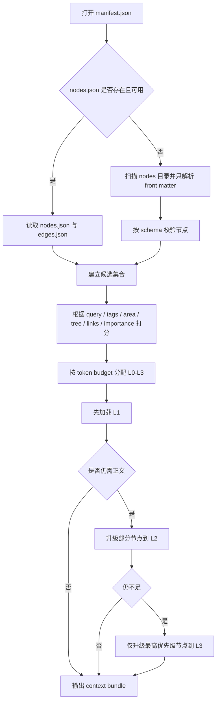

# MDT Markdown Tree 最终方案报告

## 执行摘要

本报告建议将 MDT 定义为一种**以 CommonMark 正文为核心、以 YAML front matter 承载节点元数据、以项目目录和归档容器承载索引与资源**的“格式族”，而不是再发明一门新的 Markdown 语法。CommonMark 本身是面向结构化文档的纯文本格式；front matter 不是 CommonMark 核心规范的一部分，但在 Hugo、Jekyll 及 CommonMark 生态扩展中已形成稳固的事实标准，且可以在不解析全文的前提下单独提取。citeturn7search0turn15view0turn16view0turn11view9turn12view3

对个人与小团队笔记系统，核心方案应优先保证**手写友好、Git 友好、可渐进实现**：v0.1 只做 Node → Project → Archive 三层、links/edges 分工、L0-L3 读取层级、手工维护的 `area/tags` 与可选的全局指标索引；embedding、语义聚类、向量索引全部降级为可选插件。Obsidian 的现有实践也说明，笔记系统最先稳定下来的不是“自动语义”，而是 backlinks、outgoing links、properties、基于属性的数据视图与图谱视图。citeturn11view7turn11view8turn19view0

在容器层，`.mdtz` 归档建议借鉴 EPUB/OPC 的开放容器经验：使用 ZIP 单文件容器、固定根 `manifest.json`、可选首文件 `mimetype`、统一资源清单与可验证结构。EPUB 的 OCF ZIP 容器和 Package Document 证明了“单文件打包 + 清单 + 默认顺序/关系”的开放架构可长期演进；MDT 可以采纳其简化精神，而不必引入 EPUB 的 XML 复杂度。citeturn11view6turn22view0turn22view1turn24view0turn24view1turn11view15

最终建议是：**MDT v0.1 以文件系统为真源，以生成索引为缓存，以 Reader 的 L0-L3 上下文展开为 AI 接口，以 Agent Skill 的审计与安全规则为协作边界**。这样既能满足笔记系统场景，又不把项目过早推向昂贵的 embedding/向量数据库路线。citeturn12view3turn12view1turn14view0turn14view1

## 设计目标与适用场景

MDT 的设计目标不应是“替代 Markdown”，而应是**为 Markdown 笔记增加稳定的树位、关系与读取协议**。这一判断有两个现实基础：其一，CommonMark 作为纯文本规范已经足够承担正文表达；其二，front matter 与 note properties 已经被现有工具广泛用于内容描述、关系建立与数据视图。Obsidian 文档明确把 backlinks、outgoing links、broken links、properties、tags 视为 Vault 维护与重新发现的重要对象；其 Bases 开发文档也把“从 note properties 动态渲染列表视图”作为一等能力。citeturn7search0turn15view0turn11view7turn11view8

| 目标 | 设计含义 | v0.1 取舍 |
|---|---|---|
| 手写友好 | 节点文件必须仍是普通 UTF-8 文本，front matter 尽量少且可读 | 采用 YAML front matter；正文保持 CommonMark |
| Git 友好 | 尽量减少多文件级联改写与二进制依赖 | 不把 backlinks 写回文件；`edges.json` 作为生成物 |
| 轻量可实现 | 单机、单仓库、无数据库即可运行 | 不强依赖 graph DB / vector DB |
| AI 可读取 | Reader 先读结构与摘要，再按预算展开正文 | 采用 L0-L3 读取层级 |
| 可演进 | v0.2/v0.3 可加入 metrics、clusters、embeddings | 通过 `indexes/` 与 `extensions` 预留扩展点 |
| 可归档 | 项目应能压缩为单文件分发与备份 | 使用 `.mdtz` ZIP 容器 |

如果未指定规模，本报告默认**个人 / 小团队优先**。这是因为现有笔记工具的主要增益来自链接、属性和轻量索引，而不是先上重型语义栈。对于大规模库，Obsidian 的开发文档也提醒无过滤的数据视图可能包含“上千条”文件项，前端和读取器需要避免一次性渲染全部内容；这正说明格式设计应先把“按需读取”做好，再考虑语义检索。citeturn2search10turn11view8

| 场景 | 推荐部署 | 索引策略 | 是否引入 embedding |
|---|---|---|---|
| 个人笔记 | 单仓库、本地 CLI、节点文件为主 | `nodes.json` 本地生成即可；`edges.json` 可选提交 | 否，除非搜索明显失效 |
| 小团队协作 | Git 仓库 + CI 校验 + 发布包 | `manifest.json` 必提交；`nodes.json`/`edges.json` 由 CI 生成后提交或发布 | 通常否；先做 tags/area/importance |
| 大规模知识库 | 文件系统为真源，外加 graph/vector 镜像 | 提交源文件；索引和向量层走单独构建流水线 | 可选；当标签维护失控、跨语义检索需求明确时引入 |

对兼容性，本报告建议**规范对象的 Node 叫 `.mdt`，但实现层可以提供 `.md` 兼容导入/导出模式**。这允许 MDT 保持独立身份，同时不切断与现有 Markdown 工具链的互操作。

## 分层格式定义

MDT 应定义为三层：**Node/.mdt、Project/.mdt/、Archive/.mdtz**。这一分层借鉴了开放容器格式的成熟做法：正文资源保持普通文件，包级 manifest 集中描述索引与资源，归档层再将其压缩为单文件容器。EPUB/OPC 的经验表明，这样的“文件系统真源 + 单文件打包”架构既适合日常编辑，也适合交换、发布与备份。citeturn11view15turn11view6turn22view0turn22view1

**Node 层**是单个知识节点。正文保持 CommonMark；头部使用 YAML front matter。front matter 不是 CommonMark 标准本身，但可视作应用层约定；League CommonMark 扩展文档还明确说明了 front matter 必须位于文件开头，并且可以只解析 front matter 而不解析整篇 Markdown。citeturn16view0turn12view3turn11view9

```yaml
---
mdt_version: "0.1.0"

id: "018f6a76-6d7f-7b58-a5d7-8cf44cf8d2a1"
title: "MDT 文件结构设计"
slug: "mdt-file-structure"

tree:
  parent: null
  order: 10
  path: ["root", "format-design"]
  depth: 1

tags:
  - markdown
  - note-system
  - file-format

area: "format-design"
importance: 4
summary: "MDT 是一种以 Markdown 正文为核心、以树位与边表为辅助的笔记项目格式。"

links:
  - target: "018f6a76-7011-7d4a-b7c8-40d6f0b9fb6a"
    type: "reference"
    label: "读取器设计"

  - target: "018f6a76-70aa-7c24-8c6f-812ea1d26f31"
    type: "related"
    label: "边表设计"

storage:
  tier: "hot"
  pinned: false

content_hash: "sha256:..."
---
# MDT 文件结构设计

这里是标准 CommonMark 正文。
```

**Project 层**是一个项目目录，扩展名建议使用 `.mdt/`。根目录应固定使用 `manifest.json`；`nodes/` 为真源节点目录；`edges.json` 与 `indexes/` 为生成索引；`assets/` 放二进制资源；`skills/`、`logs/`、`snapshots/` 作为运行与归档辅助层。EPUB 的 Package Document 会集中管理 metadata、manifest 与默认阅读顺序；MDT 的 `manifest.json` 可以采取同样的“集中说明”思路，但使用 JSON 而不是 XML。citeturn22view0turn22view1turn11view15

```text
knowledge-base.mdt/
├─ manifest.json
├─ nodes/
│  ├─ 018f6a76-6d7f-7b58-a5d7-8cf44cf8d2a1.mdt
│  ├─ 018f6a76-7011-7d4a-b7c8-40d6f0b9fb6a.mdt
│  └─ 018f6a76-70aa-7c24-8c6f-812ea1d26f31.mdt
├─ assets/
│  └─ images/
├─ edges.json
├─ indexes/
│  ├─ nodes.json
│  ├─ metrics.json
│  └─ clusters.json
├─ skills/
│  └─ feroha-reader.skill.md
├─ logs/
│  └─ audit.jsonl
└─ snapshots/
   └─ 2026-05-29.mdtz
```

`manifest.json` 建议如下：

```json
{
  "format": "mdt-project",
  "version": "0.1.0",
  "project_id": "018f6a77-1b41-7200-9d29-6df0b4d21011",
  "title": "My MDT Vault",
  "root_nodes": [
    "018f6a76-6d7f-7b58-a5d7-8cf44cf8d2a1"
  ],
  "node_dir": "nodes",
  "asset_dir": "assets",
  "edge_index": "edges.json",
  "indexes": {
    "nodes": "indexes/nodes.json",
    "metrics": "indexes/metrics.json",
    "clusters": "indexes/clusters.json"
  },
  "generated": {
    "edges": true,
    "indexes": true
  },
  "compat": {
    "unknown_fields": "preserve",
    "body_markdown": "commonmark"
  }
}
```

`edges.json` 是规范化的边表，由 Reader/Indexer 生成，不要求作者日常手改：

```json
{
  "format": "mdt-edges",
  "version": "0.1.0",
  "generated_at": "2026-05-29T10:30:00+07:00",
  "edges": [
    {
      "id": "edge-0001",
      "source": "018f6a76-6d7f-7b58-a5d7-8cf44cf8d2a1",
      "target": "018f6a76-7011-7d4a-b7c8-40d6f0b9fb6a",
      "type": "reference",
      "origin": "frontmatter",
      "confidence": 1.0
    }
  ]
}
```

`indexes/nodes.json` 作为 Reader 的轻量入口：

```json
{
  "format": "mdt-node-index",
  "version": "0.1.0",
  "generated_at": "2026-05-29T10:31:00+07:00",
  "nodes": [
    {
      "id": "018f6a76-6d7f-7b58-a5d7-8cf44cf8d2a1",
      "path": "nodes/018f6a76-6d7f-7b58-a5d7-8cf44cf8d2a1.mdt",
      "title": "MDT 文件结构设计",
      "slug": "mdt-file-structure",
      "parent": null,
      "depth": 1,
      "area": "format-design",
      "tags": ["markdown", "note-system", "file-format"],
      "importance": 4,
      "storage_tier": "hot",
      "summary": "MDT 是一种以 Markdown 正文为核心、以树位与边表为辅助的笔记项目格式。",
      "content_hash": "sha256:..."
    }
  ]
}
```

`indexes/metrics.json` 和 `indexes/clusters.json` 在 v0.1 都是**可缺省**文件。前者承载全局图指标，后者承载未来的语义聚类或 embedding 扩展。

| 文件 | 是否必需 | 说明 | 核心字段 |
|---|---|---|---|
| `manifest.json` | 是 | 项目根清单 | `format/version/project_id/root_nodes/node_dir` |
| `nodes/*.mdt` | 是 | 真源节点文件 | `id/title/tree/tags/area/links/storage` |
| `edges.json` | 否但推荐 | 规范化边表缓存 | `source/target/type/origin/confidence` |
| `indexes/nodes.json` | 否但推荐 | Reader 轻量入口 | `id/path/title/depth/area/tags/summary` |
| `indexes/metrics.json` | 否 | 可选 β 指标 | `in_degree/out_degree/degree/pagerank` |
| `indexes/clusters.json` | 否 | 可选 γ 聚类 | `cluster_id/label/model/version` |
| `skills/*.skill.md` | 否 | Agent 协议卡 | 读取、写回、审计规则 |
| `logs/audit.jsonl` | 否但推荐 | 审计记录 | `time/actor/action/target/old_hash/new_hash` |

**Archive 层**使用 `.mdtz`，建议采用 ZIP 单文件容器。EPUB OCF 证明 ZIP 容器适合开放格式交换与交付；其 `mimetype` 首文件模式也很适合 MDT 做快速识别。本报告建议 `.mdtz` 固定根 `manifest.json`，可选首文件 `mimetype`，内容为 `application/vnd.mdt+zip`，并要求 `manifest.json` 路径固定为 `/manifest.json`，从而避免再设计额外的 `container.xml`。citeturn11view6turn24view0turn24view1turn24view2

```text
my-vault.mdtz
├─ mimetype
├─ manifest.json
├─ nodes/
├─ assets/
├─ edges.json
├─ indexes/
├─ skills/
└─ logs/
```

## 最小可行规范

v0.1 的核心原则是：**只把“作者必须维护的最小结构”放入 node front matter，把“全局计算结果”移到项目索引层**。这样既符合手写友好，也符合 JSON Schema 的验证思路。JSON Schema Draft 2020-12 明确用于描述结构、约束与数据类型；Ajv 与 Python `jsonschema` 都原生支持 2020-12。citeturn11view0turn12view0turn12view1turn12view2

| 字段 | 类型 | 必需 | 规则 |
|---|---|---|---|
| `mdt_version` | string | 是 | `x.y.z` 语义化版本 |
| `id` | string | 是 | 推荐 UUIDv7；也可接受 ULID |
| `title` | string | 是 | 非空，建议 ≤ 200 字符 |
| `tree.parent` | string/null | 是 | 根节点可为 `null` |
| `tree.order` | integer | 是 | `>= 0` |
| `tree.path` | array[string] | 否 | 建议保留，便于 L0 导航 |
| `tree.depth` | integer | 否 | 可生成；若存在需 `>= 0` |
| `tags` | array[string] | 否 | 去重；建议小写或统一风格 |
| `area` | string | 否 | 人工维护的主题区块 |
| `importance` | integer | 否 | 建议范围 `1..5` |
| `summary` | string | 否 | Reader 的 L1 首选摘要 |
| `links` | array[object] | 否 | 仅表达节点间显式关系 |
| `storage.tier` | enum | 否 | `hot/warm/cold/frozen` |
| `content_hash` | string | 否 | 生成字段，不建议手写 |

项目级验证分为**语法验证**与**一致性验证**。语法验证只看单文件：front matter 是否在文件首部、YAML 是否可解析、字段是否满足 schema。由于 front matter 不是 CommonMark 标准的一部分，实现必须先把它剥离出来再交给 Markdown 解析器；League CommonMark 扩展文档还指出可以只解析 front matter 而不解析整篇正文。citeturn16view0turn12view3

一致性验证则看整个项目：

| 规则 | 级别 | 说明 |
|---|---|---|
| `id` 全局唯一 | 错误 | 同一 Project 不允许重复 `id` |
| `root_nodes` 必须存在 | 错误 | `manifest.json` 中列出的根节点必须解析成功 |
| `tree.parent` 必须可解析或为空 | 错误 | 防止悬空父指针 |
| 父链不可成环 | 错误 | 树层必须无环 |
| `links[].target` 必须指向已存在节点 | 发布模式错误；作者模式警告 | 便于增量编辑 |
| `links[].type` 必须属于内置枚举或扩展命名空间 | 错误 | 避免类型漂移 |
| 未知字段一律保留 | 非错误 | 保证可扩展性 |
| `content_hash` 不匹配 | 警告 | 允许文件编辑后延迟重建索引 |

下面给出一个可运行的 `node-frontmatter.schema.json` 草案。YAML front matter 在实现时先解析为对象，再按此 JSON Schema 校验即可。citeturn12view0turn12view1turn12view2

```json
{
  "$schema": "https://json-schema.org/draft/2020-12/schema",
  "$id": "https://example.org/mdt/node-frontmatter.schema.json",
  "title": "MDT Node Frontmatter",
  "type": "object",
  "additionalProperties": true,
  "required": ["mdt_version", "id", "title", "tree"],
  "properties": {
    "mdt_version": {
      "type": "string",
      "pattern": "^\\d+\\.\\d+\\.\\d+$"
    },
    "id": {
      "type": "string",
      "minLength": 8
    },
    "title": {
      "type": "string",
      "minLength": 1
    },
    "slug": {
      "type": "string"
    },
    "tree": {
      "type": "object",
      "required": ["parent", "order"],
      "properties": {
        "parent": {
          "type": ["string", "null"]
        },
        "order": {
          "type": "integer",
          "minimum": 0
        },
        "path": {
          "type": "array",
          "items": { "type": "string" }
        },
        "depth": {
          "type": "integer",
          "minimum": 0
        }
      }
    },
    "tags": {
      "type": "array",
      "items": { "type": "string" },
      "uniqueItems": true
    },
    "area": { "type": "string" },
    "importance": {
      "type": "integer",
      "minimum": 1,
      "maximum": 5
    },
    "summary": { "type": "string" },
    "links": {
      "type": "array",
      "items": {
        "type": "object",
        "required": ["target", "type"],
        "properties": {
          "target": { "type": "string" },
          "type": {
            "type": "string",
            "enum": ["parent", "reference", "related", "source", "sequence"]
          },
          "label": { "type": "string" },
          "confidence": {
            "type": "number",
            "minimum": 0,
            "maximum": 1
          }
        },
        "additionalProperties": true
      }
    },
    "storage": {
      "type": "object",
      "properties": {
        "tier": {
          "type": "string",
          "enum": ["hot", "warm", "cold", "frozen"]
        },
        "pinned": { "type": "boolean" }
      },
      "additionalProperties": true
    },
    "content_hash": {
      "type": "string",
      "pattern": "^sha256:[a-fA-F0-9]{64}$"
    }
  }
}
```

工程实现上，TypeScript 可由 Ajv 执行 schema 校验；Python 可用 `jsonschema.validate()` 或 `Draft202012Validator`。Python `jsonschema` 文档同时提醒：验证器会先检查 schema 自身是否有效，而**不受信任的 schema** 应沙箱化处理；这与 YAML front matter 解析扩展文档中“不应开启危险反序列化”的安全警告是同一类问题。citeturn12view1turn12view3

## 读取器与上下文展开

MDT Reader 的职责不是“把整库全读进来”，而是**先读取结构，再按任务与预算逐步展开**。front matter 可独立解析这一事实，为 L0-L1 的极轻量读取提供了天然支点；而 `nodes.json` 作为项目级摘要索引，可以在存在时进一步减少冷启动成本。citeturn12view3turn12view0

本报告建议 Reader 统一使用四级加载：

| 层级 | 读取内容 | 典型用途 |
|---|---|---|
| L0 | `id/title/tree/area/tags/importance/storage` | 全库浏览、候选召回 |
| L1 | L0 + `summary/links/headings` | 主题筛选、相邻节点判断 |
| L2 | L1 + 相关段落或相关标题下正文片段 | 回答问题、写摘要、构建局部上下文 |
| L3 | 全文 + 必要资源引用 | 深读、编辑、导出、归档前校验 |

下面的流程图给出标准 Reader 流程。其基本思想是：优先读 `manifest.json` 和 `nodes.json`；缺索引时退化为 front matter-only 扫描；先选候选，再按 token budget 逐步升级到 L2/L3。这样做与现代笔记工具对 properties/backlinks/graph 的组织方式一致，也符合大型数据视图“避免一次性处理全部正文”的工程原则。citeturn11view7turn11view8turn2search10



为了让 Reader 行为稳定，建议打分显式化。一个足够轻量且手工可解释的 v0.1 评分函数如下：

```text
score(node) =
  0.35 * keyword_match(query, title, tags, area)
+ 0.20 * summary_match(query, summary)
+ 0.15 * same_branch_bonus(seed, tree.path/parent)
+ 0.15 * direct_link_bonus(seed, links/edges)
+ 0.10 * importance_norm(importance)
+ 0.05 * storage_bonus(storage.tier)
```

在此基础上，再决定展开层级：

| 条件 | 默认层级 |
|---|---|
| 直接命中标题/slug，且 `importance >= 4` | L3 |
| 命中摘要或 tags，且是 seed 的父节点/子节点 | L2 |
| 只是同一 `area` 或同一树枝附近节点 | L1 |
| 冷门、远邻、冷存节点 | L0 |

参考伪代码如下：

```python
def load_context(project, query, token_budget):
    manifest = read_manifest(project)
    node_index = load_nodes_index_or_scan_frontmatter(project)
    edge_index = load_edges_if_available(project)

    seeds = recall_candidates(node_index, query)
    candidates = expand_neighbors(
        seeds,
        node_index=node_index,
        edge_index=edge_index,
        include_parents=True,
        include_children=True,
        max_graph_hops=1
    )

    ranked = rank_candidates(candidates, query=query)
    bundle = []

    for node in ranked:
        level = choose_level(node, ranked, query)
        cost = estimate_token_cost(node, level)

        while cost > token_budget and level != "L0":
            level = downgrade(level)
            cost = estimate_token_cost(node, level)

        if cost <= token_budget:
            bundle.append(load_node(node, level))
            token_budget -= cost

        if token_budget <= 0:
            break

    return bundle
```

最终，Reader 输出的不是“原始文件列表”，而是**带理由的上下文包**。这使 Agent 能解释“为什么读了这几个节点、每个节点读到什么层级、还剩多少预算”，从而避免黑箱式暴读。

## 算子、边表与标识策略

MDT 里可以保留 α、β、γ 三算子的概念，但必须做工程化拆分。图算法与知识图谱实践都表明，**树位信息、图指标和语义区块不是同一种数据**：树位更适合节点自带元数据；图中心性更适合全局索引；语义区块在轻量模式下应先由人工 `area/tags` 承担，embedding 仅作为后续插件。Neo4j 的 property graph 模型是“节点 + 关系”；NetworkX 则把 degree、in-degree、out-degree、betweenness、PageRank 等中心性作为图层算法输出。citeturn11view10turn11view3turn11view4turn12view4

| 算子 | 工程化字段 | 默认存储位置 | v0.1 建议 |
|---|---|---|---|
| α | `tree.parent / tree.order / tree.path / tree.depth` | front matter 为主，`depth` 可回写 index | 必做 |
| β | `in_degree / out_degree / degree / pagerank` | `indexes/metrics.json` | 可选，不放进手写核心 |
| γ | `area / tags`；未来可加 `cluster_id` | front matter 先手工维护；聚类再放 `clusters.json` | 手工版本必做，embedding 版本后置 |

更细一点看，三种存储策略的优缺点如下：

| 方案 | 优点 | 缺点 | 推荐度 |
|---|---|---|---|
| 放在 front matter | 手写可见、便于 diff、单文件自描述 | β/聚类类字段易漂移，改一个链接可能牵动全库 | α 强烈推荐；γ 只放人工 `area/tags` |
| 放在全局 index | 易重算、适合缓存全局指标、减少正文污染 | 索引和真源文件可能短暂不一致 | β 强烈推荐；γ 的自动聚类版本推荐 |
| 可选 embedding 插件 | 可做跨语义召回、自动发现隐含关系 | 计算与维护成本高，且聚类稳定性差 | 仅 v0.3 以后按需启用 |

`links` 与 `edges.json` 的分工必须明确。Graph Link Types 插件已经展示了“在 front matter 或内联元数据里写关系，再在图中渲染类型”的模式；这很适合 MDT 的**单文件 authoring**。但全局 Reader 与 Agent 需要的是**规范化边表**，因此 `edges.json` 才是图计算与反向链接生成的统一输入。citeturn19view0turn11view10

| 层 | 作用 | 是否手改 |
|---|---|---|
| `links` | 作者显式声明本节点的出链、类型、标签 | 是 |
| `edges.json` | 聚合所有 `links` 与正文里的可解析引用，形成规范边表 | 否，生成物 |
| backlinks | 由 `edges.json` 逆向计算得到 | 否，不写回文件 |

v0.1 的最小内置关系类型建议如下：

| 类型 | 含义 | 前端线型建议 |
|---|---|---|
| `parent` | 树层父子关系 | 实线 |
| `reference` | 普通引用/跳转 | 虚线 |
| `related` | 人工认定的弱相关 | 点线 |
| `source` | 来源/证据关系 | 虚线加箭头 |
| `sequence` | 顺序/流程关系 | 虚线加序号 |

其中 `semantic` 不应在 v0.1 作为核心类型，因为它天然暗示自动语义层；在“embedding 可选”的前提下，v0.1 更适合用 `related` 表达人工的弱相关。等到 v0.3 引入 embedding，再把机器生成关系单列为 `semantic` 或 `similar`。

关于 ID，`id` 应与 `slug`、`content_hash` 解耦。RFC 9562 明确规定 UUID 是 128 位标识；UUIDv7 以 Unix Epoch 毫秒时间戳填充最高 48 位，并以随机位补足其余部分，因此天然具备时间有序性。ULID 的规范则使用 48 位时间戳加 80 位随机数，也具备按字典序排序的优势。对于笔记系统，这两者都很合适；本报告优先推荐 UUIDv7，ULID 作为可接受替代。citeturn11view2turn13view0turn13view1turn13view2turn13view3turn11view14

建议的标识策略如下：

| 字段 | 作用 | 是否可变 |
|---|---|---|
| `id` | 稳定身份标识 | 否 |
| `slug` | 人类可读路径名/别名 | 可变 |
| `content_hash` | 完整性与变更检测 | 每次内容变更后刷新 |

`content_hash` 建议计算**规范化后的 authoring 内容**：UTF-8、LF 换行、剔除生成字段（如 `content_hash` 自身、可选 `tree.depth`、索引时间戳）后再求 `sha256`。这样可以显著减少伪差异。

在 Git 场景下，最佳实践是：**节点文件与 `manifest.json` 为真源；`edges.json`、`indexes/*.json` 为可重建生成物**。Git 的 `gitattributes` 文档表明，普通文本适合默认三方合并，而复杂或无确定合并语义的文件适合自定义 merge driver；因此，对于提交到仓库的生成索引，推荐在团队工作流中使用“合并后重建索引”的策略，而不是人工解析 JSON 冲突。citeturn14view0turn14view1

## 分层存储与 Agent Skill

MDT 的“压缩/解压缩”不应该理解为**让 AI 把原文压成摘要、以后再生成回来**，而应理解为**项目与上下文的分层存储和分级展开**。容器层使用 ZIP 类单文件归档，读取层使用 L0-L3 分级展开，二者解决的是不同问题。EPUB/OPC 的经验正说明：单文件容器适合交换与交付，而阅读系统仍然要靠 manifest 和资源关系做按需加载。citeturn11view6turn22view0turn22view1turn11view15

建议把存储层分成四级：

| 层级 | 含义 | 物理位置建议 | Reader 默认策略 |
|---|---|---|---|
| `hot` | 高频访问、正在编辑 | `nodes/` | 可直接进入 L1/L2 |
| `warm` | 低频但近期可用 | `nodes/` 或 `archive/warm/` | 默认 L0/L1，按需升级 |
| `cold` | 历史笔记、只偶尔追溯 | `archive/cold/` | 先只用索引，不直接读正文 |
| `frozen` | 快照/发布归档，只读 | `snapshots/*.mdtz` | 仅在明确请求时解包或挂载 |

对应的 `storage` 元数据可写成：

```yaml
storage:
  tier: "warm"
  pinned: false
  archived_at: "2026-05-29T10:30:00+07:00"
  snapshot_ref: "snapshots/2026-05-29.mdtz#018f6a76-6d7f-7b58-a5d7-8cf44cf8d2a1"
```

归档流程建议是：

1. 校验所有节点与 `manifest.json`。  
2. 重建 `edges.json` 与 `indexes/`。  
3. 生成可选首文件 `mimetype`，内容为 `application/vnd.mdt+zip`。  
4. 将 `manifest.json`、`nodes/`、`assets/`、`edges.json`、`indexes/`、`skills/`、`logs/` 打包为 `.mdtz`。  
5. 对 `frozen` 节点保留只读快照引用，不在活跃区直接编辑。  

EPUB 明确要求 `mimetype` 作为首文件且不压缩，这一模式非常适合作为 MDT 归档层的识别约定；同时，EPUB 的 package/document/manifest 分工也证明“归档包内的清单”是长期可维护的做法。citeturn24view0turn24view1turn22view0turn22view1

Agent Skill 应被视为**操作协议**，不是普通用户说明书。它至少应约束五件事：读取优先级、写回边界、新增链接流程、审计日志、安全约束。YAML/front matter 解析扩展与 Python `jsonschema` 文档都提醒了两个重要安全点：不要启用危险反序列化；不要对不受信任的 schema 做无沙箱验证。对于 MDT，这意味着 Skill 必须禁止执行 front matter 中的任意代码语义，也不能把外来 schema 当可信输入。citeturn12view3turn12view1

| 能力 | 规则 |
|---|---|
| 读取优先级 | 先 `manifest.json` → `nodes.json` → seeds → 父链 → 一跳 links → 正文片段 |
| 写回边界 | 未明确目标节点时，不允许覆写既有正文；新增内容默认写入新节点 |
| 新增链接 | 先改源节点 `links`，再重建 `edges.json`；不直接编辑 backlinks |
| 审计日志 | 每次写回都记录 `actor/action/target/old_hash/new_hash/reason` |
| 安全约束 | 不用 AI 重建未读取原文；不执行 front matter 中的代码或对象反序列化；不自动信任外部 schema 或远程资源 |

一个简化的 FeroHa 指令卡示例如下：

```markdown
# FeroHa MDT Reader Skill

你正在读取一个 MDT 项目。

读取顺序：
- 先读取 manifest.json。
- 若 nodes.json 可用，优先使用；否则只解析所有节点的 front matter。
- 根据 query 的 title/tags/area/summary 命中召回候选节点。
- 优先读取 candidates 的父节点、直接 links 邻居和 importance 较高节点。
- 在 token budget 内优先分配 L1/L2，只有在信息不足时才升级到 L3。

写回规则：
- 没有明确目标节点时，不要覆盖已有正文。
- 新增知识优先创建新节点，并给出最小 front matter。
- 关系更新只改 links；反向链接由索引重建。
- 每次写回后更新 content_hash，并追加一条 audit.jsonl 记录。

安全规则：
- 不得根据 summary 或历史缓存“重建”未读取原文。
- 不执行 front matter 中的代码、模板或对象反序列化。
- 不信任外部 schema；仅使用项目内受信 schema。
- 对 frozen 节点默认只读。
```

推荐的 `audit.jsonl` 单行示例如下：

```json
{"time":"2026-05-29T10:45:00+07:00","actor":"feroha","action":"update_links","target":"018f6a76-6d7f-7b58-a5d7-8cf44cf8d2a1","old_hash":"sha256:...","new_hash":"sha256:...","reason":"added reference to reader design"}
```

## 扩展路线、参考实现与快速上手

v0.1 稳定之后，扩展路线应严格分层推进，而不是把语义层提前塞进核心规范。NetworkX 已经提供了丰富的中心性算法；Neo4j 的 property graph 说明“节点 + 关系”足以支撑图查询；Faiss 和 Annoy 则分别覆盖了大规模 dense vector 的高效检索与 mmap 共享只读索引场景。换言之：**图层、度量层、语义层都可以在 MDT 核心不变的前提下外挂**。citeturn11view10turn11view3turn11view4turn11view12turn11view11

| 版本 | 建议新增 | 目的 |
|---|---|---|
| v0.2 | `metrics.json`、自动 backlinks、图查询 CLI、索引增量重建 | 让 β 成为稳定的全局缓存 |
| v0.3 | `clusters.json`、embedding 插件、vector index、`semantic` 边 | 让 γ 从人工 `area/tags` 进化到可计算主题区块 |
| v1.0 | 完整 schema、稳定 MIME、参考实现、测试集与兼容策略 | 形成可复用开放格式 |

何时才应引入 embedding？对个人/小团队，建议同时满足下列至少两项再考虑：**笔记量显著上升、标签维护明显失控、跨主题搜索经常漏召回、需要跨语言检索、需要自动发现隐含关系**。否则，`title + tags + area + summary + links + importance` 已足以支撑大多数笔记读取。这个判断也与 BGE-M3 一类模型的体量相符：BGE-M3 官方文档给出的模型规模约为 569M 参数、模型大小约 2.27GB，支持 100+ 工作语言、最长 8192 tokens，dense 向量维度为 1024；这对“只是做笔记文件结构设计”的项目来说，显然不应成为 v0.1 的先决条件。citeturn21view0turn20view0turn20view1turn20view3

粗略成本可这样估算：如果用 BGE-M3 的 1024 维 dense vector，单条 float32 向量约为 1024×4 bytes ≈ 4KB；10,000 篇笔记大约是 40MB 原始向量数据，若用 float16 约 20MB——这只是向量本体，不含索引元数据与构建开销。真正更重的是模型本身：2.27GB 权重意味着本地推理至少需要 GB 级常驻内存，CPU 编码时间也会明显高于纯元数据索引；官方示例还指出可通过 `use_fp16=True` 加速，但会有轻微性能折损。这些都说明 embedding 适合作为**可选插件**，而非核心格式依赖。citeturn21view0turn20view0turn11view5

技术实现上，TypeScript 与 Python 都合适。TypeScript 参考栈可以使用 `gray-matter` 解析 front matter、`remark` 或其他 AST 型 Markdown 工具处理正文、Ajv 做 schema 校验；Python 参考栈可以使用 PyYAML、`markdown-it-py`、`jsonschema`。这些工具都以“front matter/Markdown/JSON Schema”为明确职责边界，适合做参考实现。citeturn23search0turn23search1turn23search13turn23search14turn23search3turn12view2turn12view1

优先参考来源建议如下：CommonMark 与 front matter 相关问题，先看 CommonMark 规范、CommonMark 讨论区、Hugo/League CommonMark 扩展；容器层先看 EPUB OCF、EPUB Package、OPC；验证层先看 JSON Schema 2020-12、Ajv、Python `jsonschema`；图层与指标先看 Neo4j 与 NetworkX；未来语义层再看 BGE-M3、Faiss、Annoy。citeturn15view0turn16view0turn11view9turn12view3turn11view6turn22view0turn22view1turn11view15turn11view0turn12view2turn12view1turn11view10turn11view3turn11view4turn21view0turn11view12turn11view11

**快速上手指南**建议直接按下面步骤实施：

1. 在仓库根目录创建 `my-vault.mdt/`，初始化 `manifest.json`。  
2. 在 `nodes/` 下新建第一批 `.mdt` 节点，每个节点只写最少 front matter：`mdt_version/id/title/tree.parent/tree.order`。  
3. 用 `tags/area/summary/importance` 先把 L0-L1 可读取信息补齐。  
4. 用正文中的普通 Markdown 链接或 front matter `links` 表达显式关系。  
5. 运行 `mdt validate` 做语法与一致性校验。  
6. 运行 `mdt index` 生成 `edges.json` 与 `indexes/nodes.json`。  
7. 用 `mdt inspect --node <id>` 检查某节点在 Reader 看来会被加载到哪一层。  
8. 需要备份或发布时，运行 `mdt pack` 生成 `.mdtz`。  

一个最小示例仓库可以是：

```text
demo.mdt/
├─ manifest.json
├─ nodes/
│  ├─ 018f6a76-root.mdt
│  ├─ 018f6a76-reader.mdt
│  └─ 018f6a76-edges.mdt
├─ edges.json
├─ indexes/
│  └─ nodes.json
├─ skills/
│  └─ feroha-reader.skill.md
└─ logs/
   └─ audit.jsonl
```

对应的命令流建议为：

```bash
mdt init demo.mdt --title "Demo Vault"
mdt validate demo.mdt
mdt index demo.mdt
mdt inspect demo.mdt --node 018f6a76-root
mdt read demo.mdt --query "读取器如何工作" --budget 12000
mdt pack demo.mdt demo-2026-05-29.mdtz
mdt unpack demo-2026-05-29.mdtz ./restore-demo
```

如果只保留一句最终结论，那么就是：**把 MDT 的 v0.1 做成“CommonMark 正文 + YAML front matter + 项目级 manifest 与边表 + Reader 的分级展开协议”，而不要让 embedding、聚类、向量索引绑架核心格式。**这一路线最符合你当前“笔记系统、轻量、手写、Git 友好”的首要目标，也为将来的图指标和语义扩展留下了干净接口。