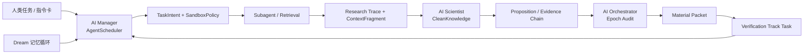

# AI 面三主体数据流审计

日期：2026-06-04  
范围：AI Orchestrator、AI Scientist、AI Manager 在 FeroHa 3.0.0 中的职责边界、数据流和本阶段优化。

## 结论

用户提出的判断基本成立：AI 面的主体可以收束为 AI Manager、AI Scientist、AI Orchestrator 三个核心角色。

- AI Manager：当前主要落在 `AgentScheduler`，并向外连接 `SkillManager`、`TaskScheduler`、sandbox policy、task intent。它负责接收任务、分类、审批、排队、运行状态、subagent 结果和 trace 上下文。
- AI Scientist：当前主要落在 `harness/scientist.rs`，并连接 proposition kernel、Lean-shaped translator、evidence chain。它负责从任务、检索结果和 trace 中提取 claims、sources、confidence map。
- AI Orchestrator：当前主要落在 `harness/orchestrator.rs`，并通过 `AgentScheduler` 的 completion path 接入。它不直接编辑文件，而是读取完成任务的 clean knowledge、Dream audit snapshot、regression metrics，决定是否开启验证轨道、退行或恢复 agent。

重要修正：代码层面还没有一个叫 “AI Manager” 的独立模块。它是 `AgentScheduler + task_intent + sandbox + skill/task scheduler` 形成的管理层。因此本阶段先把 “AI Manager” 作为产品语义和前端主体显式展示，但后续可以再抽成独立 facade。

## 代码映射

### AI Manager

核心文件：

- `src-tauri/src/ai/agent_scheduler.rs`
- `src-tauri/src/ai/task_intent.rs`
- `src-tauri/src/ai/sandbox.rs`
- `src-tauri/src/ai/skill_manager.rs`
- `src-tauri/src/ai/task_scheduler.rs`

职责：

- 接收人类任务或 AI 自发任务。
- 根据 `TaskIntentType` 决定沙箱策略、审批策略和工具边界。
- 管理 `Pending -> Approved -> Queued -> Running -> Done/Error/Cancelled` 生命周期。
- 将 retrieval evidence 写回 subagent results，并把 trace context 注入 transient context fragment。
- 将 orchestrator material packet 转成 verification track task。

### AI Scientist

核心文件：

- `src-tauri/src/harness/scientist.rs`
- `src-tauri/src/harness/proposition_kernel.rs`
- `src-tauri/src/harness/lean_translator.rs`

职责：

- 从 `AgentTask` 提取 clean knowledge。
- 将 subagent entries、context fragments、material packet claims 合并成 claims/sources/confidence map。
- 构建 evidence chain，供 proposition kernel 和 orchestrator 判断可验证性。
- 本阶段已修正 evidence confidence fallback：当 claim 没有精确证据 key 时，使用已有 evidence 中最高可信度，而不是退回固定 0.5。

### AI Orchestrator

核心文件：

- `src-tauri/src/harness/orchestrator.rs`
- `src-tauri/src/harness/workflow.rs`
- `src-tauri/src/ai/agent_scheduler.rs`

职责：

- 消费完成任务产生的 clean knowledge 和 Dream audit snapshot。
- 审计 epoch、agent 状态和 regression metrics。
- 只生成 material packet / verification track，不直接改文件。
- 给 Manager 提供需要派发的验证轨道，由 Manager 进入审批/队列/执行。

## 数据流

具体运行顺序：

1. 人类面提交 task，或 Dream/Orchestrator 生成 AI 自发任务。
2. Manager 读取 intent，生成 sandbox policy，决定 pending bridge review 或 auto approve。
3. Manager 调 subagent 检索资料，并把结果、trace、context fragment 挂回任务。
4. 任务完成后，Scientist 从 task 中提取 claims、sources、confidence。
5. Orchestrator 审计 clean knowledge、Dream snapshot 和 regression metrics。
6. 当需要验证时，Orchestrator 生成 material packet。
7. Manager 将 material packet 转成 orchestrator-track task，进入受限沙箱与验证队列。

## 本阶段优化

- 新增 `AiFaceMemoryRole`：区分 `HumanTask`、`AiMemoryExpansion`、`OrchestratorVerification`。
- 新增 `AiFaceDataFlow`：把 Manager 状态、Scientist claims/sources、context/subagent 数量、sandbox、material packet focus 统一成一个前端可读契约。
- 新增 `AgentScheduler::list_ai_face_data_flows()`：按 `created_at/id` 稳定输出 AI 面数据流。
- 新增 Tauri 命令 `list_ai_face_data_flows`：前端可直接读取三主体流，并融合本地 research trace 文件状态。
- `AgentDashboard` 新增 “AI 面三主体” 区块：同时展示 Manager、Scientist、Orchestrator 指标和最近数据流。

## Stage 续迭代：AI Manager 控制面

本次续迭代将 “AI Manager” 从产品语义推进成后端可查询契约：

- 新增 `AiManagerControlAction`：标识 Manager 当前主要控制动作，包括 `BridgeReviewPending`、`OrchestratorTrackPending`、`RunningTasks`、`DispatchReady`、`Idle`。
- 新增 `AiManagerSnapshot`：统一输出入口、审批、调度、输出和 sandbox 风险指标。
- 新增 Tauri 命令 `get_ai_manager_snapshot`：前端可以直接读取 Manager 控制面，而不再用 `flows.length` 代替 Manager 负载。
- `AgentDashboard` 增加 “Manager 控制面”：展示入口、审批、调度、输出四段，并单独展示只读、可写、网络、失败任务数量。

这一步没有把 `AgentScheduler` 大规模拆成新模块，而是先把可测试 DTO 固化下来。后续再抽 `AiManagerFacade` 时，可以直接复用这套契约，不会影响前端。

## Stage 续迭代：AI Scientist 验证质量

本次续迭代将 “AI Scientist” 从 `claims/sources` 数量展示推进成显式验证状态：

- 新增 `AiScientistVerificationState`：区分 `NoClaims`、`NotRun`、`Passed`、`Failed`。
- 新增 `AiScientistConfidenceBasis`：区分 `None`、`EvidenceFallback`、`KernelVerification`，避免把检索置信度误读成 kernel 置信度。
- 新增 `AiScientistVerificationSummary`：统一输出 `passed`、`violation_count`、`overall_confidence`、`confidence_basis`、`evidence_chain_count`、`kernel_name`、`kernel_scope`、`is_truth_proof`。
- `AiFaceDataFlow` 现在携带 `scientist_verification`，前端可以明确展示 “待验证/一致性通过/发现冲突/无命题”。
- 当当前 task 只有 clean knowledge、没有持久化的 `ScientistResult.verification` 时，后端会诚实输出 `NotRun`、`passed = None`、`kernel_scope = not_run`、`is_truth_proof = false`。
- `AgentDashboard` 不再把抽取出的 `claims/sources` 表述成验证结果，而是显示验证徽标、候选证据数量、检索置信度、kernel scope 和 “Kernel 未运行 / 非真理证明”边界。

重要边界：当前 Lean/Proposition kernel 只表达 proposition graph consistency，不是真理证明。`is_truth_proof = false` 会进入前端展示，避免用户把 Scientist 的结构检查误读成外部事实已经被证明。

## Stage 续迭代：AI Orchestrator 轨道语义

本次续迭代将 Orchestrator 的 `track_count` 歧义拆开：

- 新增 `track_event_count`：表示 `ParallelTracksSpawned` 派生事件发生了几次。
- 新增 `material_packet_count`：表示实际形成了多少个 Orchestrator material packet。
- 新增 `active_track_count`、`completed_track_count`、`failed_track_count`、`cancelled_track_count`：表示运行时轨道任务的状态分布。
- 扩展 `TrackInfo`：每条轨道现在带 `reason`、`claim_count`、`source_ref_count`，前端可以展示“为什么派生这条验证轨道”和“携带了多少材料”。
- `AgentScheduler::orchestrator_status()` 会用当前任务表覆盖 Orchestrator 的纯事件估计。也就是说，最终前端看到的活跃轨道数来自 runtime task map，而不是只从 event log 里猜。
- `AgentDashboard` 和 `OrchestratorPanel` 不再只显示“轨道：N”，而是显示“材料包 / 活跃轨道 / 派生事件”三类指标。

保留兼容：`track_count` 仍存在，但现在被设置为 `active_track_count`，避免旧调用崩溃，同时减少旧字段继续误导用户的概率。

## Stage 续迭代：Orchestrator 诊断与最小修复面

本次续迭代把 Orchestrator 的“为什么要退行/验证”推进到前端可读契约：

- 新增 `OrchestratorDiagnosticSource`：区分 `EpochReason` 与 `WorkflowVerifier`。
- 新增 `OrchestratorDiagnostic`：统一输出 `reason_code`、`summary`、`target`、`minimal_fix_surface`、`evidence_refs`、`failed_clauses`、`severity`。
- `audit_epoch` 会把 epoch reason codes 转成 diagnostics，例如 `tool_loop`、`novelty_plateau`、`evidence_plateau`、`contradiction_risk_high`。
- 新增 `Orchestrator::record_verification_findings()`：把 workflow verifier 的 `VerificationFinding` 映射进 Orchestrator status。
- `AgentDashboard` 的编排器卡片现在展示诊断摘要和第一条最小修复面。
- `OrchestratorPanel` 展开态新增“诊断与最小修复面”列表，展示 reason code、来源、target 和修复面。

当前边界：status 契约和前端展示已打通；workflow runtime 自动调用 `record_verification_findings()` 已进入下一 stage 接线。

## Stage 续迭代：Workflow verifier 运行时回流

本次续迭代把上一阶段的“可记录接口”推进成 Scheduler 层的运行时入口：

- 新增 `AgentScheduler::build_orchestrator_replan_request()`：由 Scheduler 统一构造 `OrchestratorReplanRequest`，并在构造时把 `VerificationFinding` 同步写入 Orchestrator diagnostics。
- `OrchestratorReplanRequest::from_runtime()` 仍保持纯 DTO 构造职责，不直接碰 Orchestrator；这样 workflow 模型不会反向依赖调度器或状态管理。
- `Orchestrator::record_verification_findings()` 继续作为唯一映射点，把 `VerificationOutcome::Fail/CannotVerify/Pass` 转成 `error/warning/info` 前端 severity。
- `Orchestrator::record_verification_findings()` 会去重完全相同的 diagnostic，避免同一 replan request 重复构造时刷满最近诊断列表。
- `OrchestratorPanel` 和 `AgentDashboard` 增加旧 payload 兜底：当历史后端或缓存状态缺少 `diagnostics` 字段时，前端按空诊断处理，不再在展开面板时崩溃。

当前边界：运行时 replan request 已经能回流 verifier findings；更完整的 workflow executor 仍需下一阶段把 step report 产生、verification fail、workflow patch request 串成持久事件链。

## Stage 续迭代：Workflow executor 事件链

本次续迭代把 `step report -> verification finding -> orchestrator replan request` 从一次性 DTO 推进成可审计 runtime 事件链：

- 新增 `WorkflowRuntimeEventChain`：从 `OrchestratorReplanRequest` 派生 harness events，保持 workflow 模型只读 request 摘要，不读取原始 step 输出。
- 事件链现在显式记录三类事件：`workflow.step_report.recorded`、`workflow.verification.failed/cannot_verify/passed`、`workflow.replan.requested`。
- `AgentScheduler::build_orchestrator_replan_request()` 在构造 replan request 后同步生成事件链，并把最近 workflow runtime events 纳入 scheduler 状态缓冲。
- `OrchestratorStatus` 新增 `workflow_event_count`、`workflow_replan_request_count`、`recent_workflow_events`，让 AI Orchestrator 面可以看到 verifier 失败如何触发 replan。
- `OrchestratorPanel` 新增 workflow 事件链区块，展示 severity、event name、时间、失败 step/target 与 body；`AgentDashboard` 的 Orchestrator 卡片新增 workflow event/replan 计数。

当前边界：事件链已进入运行时状态与前端展示，但仍是内存态缓冲，尚未写入 `.harness/runs`、数据库或 vault 事件日志。下一阶段应把同一事件链持久化，并让 workflow patch 的 accept/reject 结果继续接回这条链。

## Stage 续迭代：Workflow event ledger

本次续迭代把上一阶段的内存态事件链推进成项目内可持久读取的 run ledger：

- 新增 `WorkflowRuntimeEventStore`：按 `root/.harness/runs/{run_id}/events.jsonl` 追加和读取 `HarnessEvent`，用于保留 workflow executor 的可审计事件。
- `WorkflowRuntimeEventStore` 对 `run_id` 做路径组件安全校验，拒绝空值、`..`、路径分隔符和非安全字符，避免事件日志路径逃逸。
- `WorkflowRuntimeEventChain::from_patch_decision()` 新增 `workflow.patch.accepted` / `workflow.patch.rejected` 标准事件，用于把 bridge/workflow patch 决策继续接回事件链。
- `AgentScheduler` 新增可选 workflow event root；打开 vault 时会把 vault root 设置为 ledger root，因此 replan request 产生的事件会同步写入项目根 `.harness/runs/{run_id}/events.jsonl`。
- `OrchestratorStatus` 新增 `workflow_event_log_path`，`OrchestratorPanel` 展开后显示 ledger 文件路径，方便从前端回溯到磁盘事件日志。

当前边界：replan request 产生的事件已能自动持久化；patch decision 事件契约和 store 已具备，但真实 bridge accept/reject 流程尚未在运行时调用 `from_patch_decision()`。下一阶段应把 workflow patch 的审批/拒绝入口接入 ledger，并提供按 run 读取事件日志的 Tauri command。

## Stage 续迭代：Workflow patch 决策回写

本次续迭代把 patch decision 从纯事件构造契约推进到 Scheduler 运行时入口：

- 新增 `AgentScheduler::record_workflow_patch_decision()`：接收 `workflow_id`、`run_id`、`WorkflowPatch`、accept/reject 和 reason，生成 `workflow.patch.accepted` / `workflow.patch.rejected` 事件。
- patch decision 事件复用 `record_workflow_event_chain()`，因此会同时进入内存态 `recent_workflow_events`、`workflow_event_count` 和 `.harness/runs/{run_id}/events.jsonl`。
- 新增 scheduler 测试覆盖 rejected patch：状态面板能看到 `workflow.patch.rejected`，ledger 也能从同一 run 读取到该事件。

阶段交接：Scheduler 已具备 patch 决策回写入口，下一步需要由 bridge action 和 run 级读取命令接入真实运行时。

## Stage 续迭代：Bridge patch action 与 run ledger 读取

本次续迭代把人类面的 bridge 决策动作接回 AI 面 workflow runtime ledger：

- `ProposalActionKind` 新增 `approve_workflow_patch` / `reject_workflow_patch`，前端 `BridgeProposalActionKind` 同步扩展，避免 workflow patch 继续伪装成普通 task approval。
- `execute_bridge_action` 现在会解析 workflow patch payload，校验 `workflow_id` 一致性，并调用 `AgentScheduler::record_workflow_patch_decision()` 写入 `workflow.patch.accepted` / `workflow.patch.rejected`。
- 新增 `AgentScheduler::workflow_runtime_events_for_run()` 和 Tauri command `read_workflow_runtime_events`，可按 `run_id` 读取 `.harness/runs/{run_id}/events.jsonl`，无 vault root 时回退读取内存事件。
- `useAppStore.fetchWorkflowRuntimeEvents(runId, limit)` 接入前端 IPC；`OrchestratorPanel` 在 workflow 事件链区域新增“读取 run ledger”动作，并优先展示同一 run 的持久化事件。
- 补充 bridge approve/reject、scheduler ledger read、前端 store、OrchestratorPanel 测试，保证人类面决策可以回写并被 AI 面观察。

阶段交接：bridge 执行路径和 run ledger 读取已经接通；下一步需要让真实 workflow patch proposal producer 生成 `approve_workflow_patch` / `reject_workflow_patch` 动作，而不是只在测试或手动构造 proposal 中出现。

## Stage 续迭代：Workflow patch proposal producer

本次续迭代把 workflow patch proposal 从手工构造推进到可调用的运行时生产入口：

- 新增 `BridgeProposal::for_workflow_patch()`：以 `run_id + WorkflowPatch` 生成 scheduler 来源的 bridge proposal，`source_ref` 同时标记 run 和 workflow，actions 固定为 `approve_workflow_patch` / `reject_workflow_patch`。
- proposal payload 会携带完整 `WorkflowPatch`、`workflow_id`、`run_id` 和默认 reason，供 `execute_bridge_action` 直接写入 workflow runtime ledger。
- 新增 `submit_workflow_patch_review` Tauri command：运行时可提交 `run_id + patch`，命令会写入 `BridgeProposalStore` 并广播 `bridge-proposal-updated`。
- 前端 `useAppStore.submitWorkflowPatchReview()` 接入该命令，提交成功后会把 proposal 合并进 `bridgeProposals`，让 bridge inbox 可以即时出现 workflow patch 审查项。
- 补充 producer、store 写入和前端 IPC 测试，覆盖从 patch 构造到 bridge inbox 缓存的可调用链路。

当前边界：workflow patch proposal producer 已有可调用命令面；仍需把真实 workflow executor / orchestrator output 的 `OrchestratorOutput::WorkflowPatch` 分支自动接到 `submit_workflow_patch_review` 或同等后端 helper。

## Stage 续迭代：OrchestratorOutput 自动路由到 Bridge

本次续迭代把 producer 从 patch 专用入口推进到 orchestrator 输出级路由：

- 新增 `store_orchestrator_output_bridge_proposal()`：接收 `run_id + OrchestratorOutput`，当输出为 `WorkflowPatch` 时自动生成并存储 workflow patch bridge proposal。
- 新增 `submit_orchestrator_output_review` Tauri command：workflow executor 可以提交原始 `OrchestratorOutput`，由后端判断是否需要 bridge inbox 审查。
- 前端新增 `OrchestratorOutput` 类型和 `useAppStore.submitOrchestratorOutputReview()`，使 UI/运行时桥接层可以传递完整输出对象，而不是只传 patch 子对象。
- 保留 `submit_workflow_patch_review` 作为兼容的窄入口；宽入口负责贴近 orchestrator dynamic workflow 的真实输出契约。
- 补充后端路由测试和前端 IPC 测试，覆盖 `OrchestratorOutput::WorkflowPatch -> BridgeProposalStore -> bridgeProposals`。

当前边界：`OrchestratorOutput::WorkflowPatch` 已有后端/前端路由入口；仍需把具体 workflow executor 调用点接到 `submit_orchestrator_output_review` / `store_orchestrator_output_bridge_proposal()`，让运行时无需手工调用命令。

## 审计风险

- Scientist verification summary 已能避免误导展示，但 actual `ScientistResult.verification` 尚未持久化回 `AgentTask` 或事件流。后续应在 refine 完成后保存真实 `Passed/Failed`、violations 和 diagnostics。
- Orchestrator diagnostics、workflow runtime event chain、replan JSONL ledger、bridge workflow patch approve/reject、run 级读取命令、workflow patch proposal producer command 和 `OrchestratorOutput` 路由命令已进入 status/前端/磁盘链路。下一 stage 应把真实 workflow executor 的输出提交点接入该路由。

## 下一阶段建议

- 将 AI Manager 从 `AgentScheduler` 中抽一层 facade，避免调度器承担过多产品语义。
- 将 `AiFaceDataFlow` 持久化为事件流，而不是只读当前 task map。
- 把 Dream 记忆分块、MDT 数值 tag、graph view 前端效果接到同一套 memory role / material packet 契约。
- 将 orchestrator dynamic workflow 文档中的 runtime sandbox/tool constraints 继续下沉到 subagent 执行器，而不是只停留在 prompt 约束。
- 在 AI 面加入可折叠的数据流详情页，展示每个 task 的 trace、claims、sources、material packet、sandbox policy。
