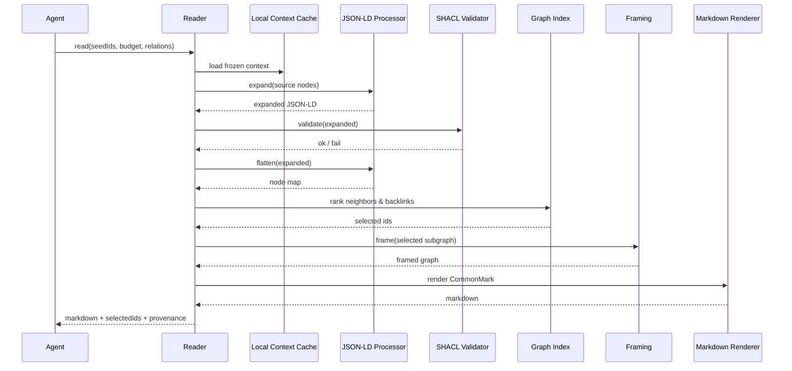
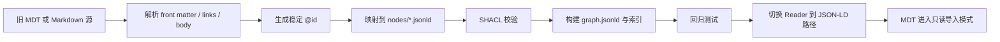

# 为 FeroHa AI 面以 JSON-LD 替换 MDT 的技术手册

## 执行摘要

对 FeroHa AI 面而言，理性的最终结论是：**不应继续把 MDT 作为新的底层事实格式推进**，而应改用 **JSON-LD 作为源事实层**，把 Markdown 降级为**渲染层与导出层**。原因很直接：JSON-LD 已是 W3C Recommendation，且与 JSON 兼容；同时它本身就是 RDF 的具体语法，而 RDF 的抽象数据模型天然就是“节点—关系”图，足以直接承载你原来想在 MDT 中表达的树、引用和语义关联。CommonMark 则继续承担“可读文本视图”的职责，而不是承担语义主存储。citeturn11view0turn26view0turn20view0

原来 MDT 里的 α、β、γ 三类“坐标”不应再是本体字段，而应降级为**派生索引**：层级深度来自 `isPartOf/hasPart`，连通度来自显式边统计，主题簇默认来自规则标签与显式 `about/mentions/keywords`，只有在后续确实需要时才外挂向量索引。这样做的好处是，关系语义由标准 vocabulary 承担，校验由 SHACL 承担，审计由 PROV-O 承担，文档权限可落在 schema.org 的 `DigitalDocumentPermission` 模型上。citeturn12view0turn12view1turn13search0turn13search1turn13search6turn11view4turn11view5turn27view0turn28search1turn31search5

工程上最关键的替换原则是：使用**本地、版本化、`@protected` 的 context**；生产环境禁止热路径随意抓取远程 context；读取器走 `expand → validate → flatten → frame → render`；快照和签名层使用确定性 JSON 表达，而不是发明新的“语义压缩”文件格式。若未来确实出现体积分发压力，应优先评估 W3C 正在推进的 **CBOR-LD** 这类可逆压缩，而不是回到 MDT 的数值编码路线。citeturn16view0turn16view1turn16view2turn23view1turn23view2turn11view2turn22view2turn32view0

## 核心定义与替换原则

本手册中的“必须 / 应 / 可选”是本项目规范用语。凡标注“未指定”的地方，表示当前上下文未提供 FeroHa 既有约定；本文会给出**建议值**，但不把它误写成既有事实。

| 术语 | 本手册定义 |
|---|---|
| 源事实 | `nodes/*.jsonld` 中的紧凑 JSON-LD 节点文件；唯一可写事实源 |
| 图缓存 | `indexes/graph.jsonld`；由源事实构建，供 Reader 冷启动与遍历 |
| 派生索引 | `depth / degree / cluster / importance` 等可重建值；不是事实源 |
| 视图文档 | 由 Framed JSON-LD 通过模板生成的 CommonMark 或 HTML |
| 技能卡 | Reader / Writer agent 的机器契约；FeroHa 传输格式当前未指定 |
| 快照 | 带 manifest 与哈希校验的全量可恢复包 |

下表把 JSON-LD 方案与 MDT 原始目标逐项对齐。比较依据主要来自 JSON-LD 的 compaction / expansion / flattening / framing 能力，RDF 图模型，SHACL/PROV-O，schema.org 的文档与权限类型，以及 CommonMark 的渲染与测试机制。citeturn23view0turn23view1turn23view2turn11view2turn26view0turn11view4turn11view5turn27view0turn28search1turn20view0

| 核心功能 | JSON-LD 替代方案 | MDT 原始设想 | 结论 |
|---|---|---|---|
| 节点身份 | `@id` 使用稳定 IRI | 文件名 / 哈希 / 自定义主键 | 统一用 `@id` |
| 树结构 | `schema:isPartOf` / `schema:hasPart` | α 深度坐标 | α 变为派生索引 |
| 引用关系 | `schema:citation` | 自定义边编码 | 用标准属性 |
| 主题关系 | `schema:about` / `schema:mentions` / 自定义 `fh:LinkEdge` | γ 语义区块 + 连线 | 显式边为主，γ 仅做索引 |
| 连接强度 | `degree` / `importance` 派生缓存 | β 密度坐标 | β 变为派生索引 |
| 双向链接 | 运行时构建逆向索引 / cache | 文件级自动回链 | 由构建器生成，不写入事实源 |
| 校验 | SHACL | 自定义解析器 | SHACL 更稳健 |
| 审计 | PROV-O | 未系统定义 | 用 PROV-O |
| 权限 | `DigitalDocumentPermission` + 运行时 ACL | 区域或文件私有约定 | 宣告层标准化，执行层本地化 |
| 渲染 | Framing + CommonMark 模板 | 文件本身兼顾语义与展示 | 语义与展示分层 |
| 压缩 | 包级压缩 / 未来可选 CBOR-LD | 自定义数值压缩 | 不在语义层造压缩格式 |
| 增量更新 | JSON Patch + JSON Pointer | 自定义写入协议 | 直接复用 RFC |

替换原则可以凝练成一句话：**JSON-LD 管语义，Markdown 管展示，索引管速度，快照管恢复**。因此，`*.mdt` 从 v0.1 起仅保留为导入源，不再作为新增持久化格式；新的写路径只写 `*.jsonld` 源节点与生成物。这个判断也符合 schema.org **不定义“必填属性”**的事实：FeroHa 可以在标准词汇之上定义更严格的本地 profile，而不必再自造一门新语法。citeturn12view8turn27view0turn15search1turn22view1

## 分层架构与数据模型规范

建议采用“三形态、两套件”的分层：源节点用**紧凑形 JSON-LD**保存，运行时索引用**扁平形 JSON-LD**构建，视图层用 **Framed JSON-LD → CommonMark** 生成；配套只有两种必需契约——本地版本化 `@context` 与 SHACL shapes。之所以要把 `graph.jsonld` 定位成**生成物**而不是唯一事实文件，是因为当前 JSON-LD 推荐算法默认是内存内处理、并不天然流式；大图应通过 shard、flatten cache 和命名图拆分来控制成本。citeturn23view0turn23view2turn11view2turn11view10turn26view0

| 示例路径 | 层级 | 必需性 | 角色 |
|---|---|---:|---|
| `context/feroha-v1.jsonld` | 语义层 | 必需 | 本地、冻结、版本化 context |
| `shapes/feroha-v1.ttl` | 校验层 | 必需 | SHACL 规则集 |
| `nodes/*.jsonld` | 源事实层 | 必需 | 每个记忆节点一个源文件 |
| `indexes/graph.jsonld` | 运行时层 | 必需 | 由源节点构建的总图或分片图 |
| `indexes/node-map.json` | 运行时层 | 应有 | `@id -> 文件位置/版本` 索引 |
| `indexes/adjacency.json` | 运行时层 | 应有 | 反向链接、邻接表、区域索引 |
| `cache/render/*.md` | 视图层 | 可选 | 预渲染 Markdown 缓存 |
| `skills/*.skill.json` | Agent 层 | 应有 | Skill 机器契约；FeroHa 格式未指定时采用建议格式 |
| `logs/audit.jsonl` | 治理层 | 应有 | 追加式审计日志 |
| `snapshots/*.tar.zst` | 运维层 | 生产必需 | 全量备份与恢复包 |
| `vector-sidecar/*` | 召回层 | 可选 | 向量索引或语义聚类 sidecar，不进入基础规范 |

如果以后要支持多工作区、分支或租户隔离，`indexes/graph.jsonld` 应升级为 RDF dataset 形式，用**命名图**承载 workspace / branch 边界；RDF 1.2 已把 dataset 定义为默认图加命名图集合。citeturn26view0

字段选择应优先使用 schema.org `CreativeWork / NoteDigitalDocument` 系列、其 `isPartOf / hasPart / citation / description / dateCreated / dateModified / version / schemaVersion / license / text` 等属性，以及 PROV-O 的溯源属性。schema.org 自身并**不**界定“哪些属性必填”，这正好允许 FeroHa 定义自己的更严格 profile。citeturn27view0turn12view0turn12view1turn12view2turn15search1turn11view5turn12view8

| 优先级 | 字段 | 推荐映射 | 类型 | 约束 | 说明 |
|---|---|---|---|---|---|
| 必须 | `@context` | 本地 frozen context | IRI / local path | 必须 | 不在生产热路径使用远程 context |
| 必须 | `@id` | RDF IRI | IRI | 必须 | 稳定、绝对、位置无关 |
| 必须 | `@type` | `schema:NoteDigitalDocument` + 自定义类型 | IRI / IRI[] | 必须 | 至少一个标准类型 |
| 必须 | `name` | `schema:name` | Text | 必须 | 节点标题 |
| 必须 | `body` | `schema:text` | Text | 必须 | Markdown 正文 |
| 必须 | `bodyFormat` | `schema:encodingFormat` | Text | 必须 | 固定为 `text/markdown` |
| 必须 | `created` | `schema:dateCreated` | DateTime | 必须 | 创建时间 |
| 必须 | `updated` | `schema:dateModified` | DateTime | 必须 | 最近更新时间 |
| 必须 | `version` | `schema:version` | Text / Number | 必须 | 源节点版本 |
| 应有 | `schemaVersion` | `schema:schemaVersion` | Text / URL | 应有 | 固定 vocabulary release |
| 应有 | `parent` | `schema:isPartOf` | IRI | 根节点可缺省 | 树父节点 |
| 可选 | `children` | `schema:hasPart` | IRI[] | 可重建 | 子节点缓存，可由构建器生成 |
| 应有 | `references` | `schema:citation` | IRI[] | 应有 | 引用关系 |
| 应有 | `about` | `schema:about` | IRI[] | 应有 | 主题对象 |
| 可选 | `mentions` | `schema:mentions` | IRI[] | 可选 | 内容提及对象 |
| 可选 | `keywords` | `schema:keywords` | Text[] | 可选 | 轻量主题标签 |
| 可选 | `license` | `schema:license` | IRI | 可选 | 许可信息 |
| 生产应有 | `hasDigitalDocumentPermission` | `schema:hasDigitalDocumentPermission` | Object[] | 生产应有 | 文档权限声明 |
| 应有 | `derivedFrom` | `prov:wasDerivedFrom` | IRI[] | 应有 | 来源链路 |
| 应有 | `attributedTo` | `prov:wasAttributedTo` | IRI | 应有 | 写入实体 |
| 应有 | `generatedAtTime` | `prov:generatedAtTime` | DateTime | 应有 | 生成时间 |
| 可选 | `region` | `fh:region` | Token | 可选 | `active / warm / archive / cold` |
| 仅索引 | `depth` | `fh:depth` | Integer | 不入事实源 | α 的替代物 |
| 仅索引 | `degree` | `fh:degree` | Integer / Number | 不入事实源 | β 的替代物 |
| 仅索引 | `cluster` | `fh:cluster` | Token | 不入事实源 | γ 的替代物 |

本地 context 必须开启 `@protected`，并把多值关系声明为 `@set`；需要 map 结构时可使用 `@id` / `@index` container，但 v0.1 先不做复杂容器。`@base` 不应写在**外部** context 中，因为 JSON-LD 1.1 明确说明外部 context 中的 `@base` 会被忽略；基础 IRI 应由读取器 API 的 `base` 选项控制。citeturn16view0turn22view0turn16view5turn25view3

```json
{
  "@context": {
    "@version": 1.1,
    "@protected": true,

    "schema": "https://schema.org/",
    "prov": "http://www.w3.org/ns/prov#",
    "xsd": "http://www.w3.org/2001/XMLSchema#",
    "fh": "https://spec.feroha.example/ns/core#",

    "id": "@id",
    "type": "@type",

    "name": "schema:name",
    "description": "schema:description",
    "body": "schema:text",
    "bodyFormat": "schema:encodingFormat",
    "created": { "@id": "schema:dateCreated", "@type": "xsd:dateTime" },
    "updated": { "@id": "schema:dateModified", "@type": "xsd:dateTime" },
    "version": "schema:version",
    "schemaVersion": "schema:schemaVersion",
    "license": { "@id": "schema:license", "@type": "@id" },

    "parent": { "@id": "schema:isPartOf", "@type": "@id" },
    "children": { "@id": "schema:hasPart", "@type": "@id", "@container": "@set" },
    "references": { "@id": "schema:citation", "@type": "@id", "@container": "@set" },
    "about": { "@id": "schema:about", "@type": "@id", "@container": "@set" },
    "mentions": { "@id": "schema:mentions", "@type": "@id", "@container": "@set" },
    "keywords": { "@id": "schema:keywords", "@container": "@set" },

    "region": "fh:region",
    "depth": "fh:depth",
    "degree": "fh:degree",
    "cluster": "fh:cluster",
    "importance": "fh:importance",
    "profileVersion": "fh:profileVersion",

    "derivedFrom": { "@id": "prov:wasDerivedFrom", "@type": "@id", "@container": "@set" },
    "attributedTo": { "@id": "prov:wasAttributedTo", "@type": "@id" },
    "generatedAtTime": { "@id": "prov:generatedAtTime", "@type": "xsd:dateTime" },

    "LinkEdge": "fh:LinkEdge",
    "source": { "@id": "fh:source", "@type": "@id" },
    "target": { "@id": "fh:target", "@type": "@id" },
    "relationType": "fh:relationType",
    "weight": "fh:weight"
  }
}
```

持久化源节点必须使用稳定、位置无关的绝对 IRI 作为 `@id`；不要把 blank node 当主键，因为 RDF 里 blank node 标识符只有本地作用域且不可移植。下面示例把源节点保持在最小必需字段，而把 `depth / degree / cluster` 放在编译后的 `graph.jsonld` 中。citeturn26view0

```json
{
  "@context": "../context/feroha-v1.jsonld",
  "id": "urn:feroha:node:vector-db-overview",
  "type": ["schema:NoteDigitalDocument", "fh:MemoryNode"],
  "name": "向量数据库概览",
  "description": "给 Agent 的向量数据库速记。",
  "body": "# 向量数据库概览\n\n## 定义\n向量数据库负责向量索引、近邻检索与元数据过滤。\n\n## 何时使用\n- 需要 ANN 检索\n- 需要 RAG 召回",
  "bodyFormat": "text/markdown",
  "created": "2026-06-03T08:00:00Z",
  "updated": "2026-06-03T08:30:00Z",
  "version": "3",
  "schemaVersion": "https://schema.org/docs/releases.html#v30.0",
  "parent": "urn:feroha:node:retrieval",
  "references": ["urn:feroha:node:hnsw"],
  "about": ["urn:feroha:topic:vector-search"],
  "mentions": ["urn:feroha:topic:ann"],
  "keywords": ["RAG", "ANN", "索引"],
  "license": "urn:feroha:license:internal",
  "derivedFrom": ["urn:feroha:node:retrieval-notes-2025"],
  "attributedTo": "urn:feroha:agent:memory-writer",
  "generatedAtTime": "2026-06-03T08:30:00Z",
  "schema:hasDigitalDocumentPermission": [
    {
      "@type": "schema:DigitalDocumentPermission",
      "schema:permissionType": "schema:ReadPermission",
      "schema:grantee": { "@id": "urn:feroha:role:agent" }
    }
  ]
}
```

```json
{
  "@context": "../context/feroha-v1.jsonld",
  "@graph": [
    {
      "id": "urn:feroha:node:retrieval",
      "type": ["schema:NoteDigitalDocument", "fh:MemoryNode"],
      "name": "检索系统",
      "children": ["urn:feroha:node:vector-db-overview"]
    },
    {
      "id": "urn:feroha:node:vector-db-overview",
      "type": ["schema:NoteDigitalDocument", "fh:MemoryNode"],
      "name": "向量数据库概览",
      "parent": "urn:feroha:node:retrieval",
      "references": ["urn:feroha:node:hnsw"],
      "region": "active",
      "depth": 1,
      "degree": 3,
      "cluster": "retrieval-core",
      "importance": 0.82
    },
    {
      "id": "urn:feroha:edge:semantic:1",
      "type": "LinkEdge",
      "source": "urn:feroha:node:vector-db-overview",
      "target": "urn:feroha:node:eval-ann",
      "relationType": "semantic",
      "weight": 0.76
    }
  ]
}
```

## 读取器、渲染与 Agent Skill 规范

读取器不再“解压 MDT”，而是执行一条显式的 JSON-LD 工作流：载入本地 context，`expand()` 去上下文并规则化结构，SHACL 校验，`flatten()` 建稳定 node-map，按查询目标 `frame()` 成树形视图，再把结果渲染为 CommonMark。这里 `expansion` 负责规则化，`compaction` 负责面向应用的简写，`flattening` 负责确定形状，`framing` 负责按例组树。citeturn23view1turn23view0turn23view2turn11view2turn11view4



Markdown 模板应只消费 frame 后结果。因为 CommonMark 会把 raw HTML 透传到 HTML 输出，所以渲染器必须在 HTML 模式下做 sanitizer，或直接禁用 raw HTML；而 Markdown 模式下则应尽量输出标准 CommonMark，便于复用官方测试集。citeturn20view0turn30view0turn30view2

```md
# {{name}}

> ID: {{id}}
> 更新: {{updated}}
> 所属: {{parentName | default("根节点")}}
> 标签: {{keywords | join("、")}}
> 区域: {{region | default("active")}}

{{body}}

## 关联
{{#if references.length}}- 引用: {{referencesAsWikiLinks}}{{/if}}
{{#if children.length}}- 子节点: {{childrenAsWikiLinks}}{{/if}}
{{#if backlinks.length}}- 反向链接: {{backlinksAsWikiLinks}}{{/if}}
```

下表给出一个最小的 JSON-LD 片段与其 Markdown 渲染结果。这个渲染是**视图**，不是事实源。citeturn23view0turn11view2turn20view0

| JSON-LD 输入摘要 | 对应渲染 Markdown |
|---|---|
| `name="向量数据库概览"`  `parent="检索系统"`  `references=["HNSW"]`  `region="active"`  `body="## 定义\n向量数据库负责..."` | `# 向量数据库概览`  `> 所属: 检索系统`  `> 区域: active`  `> 引用: [[HNSW]]`  空行  `## 定义`  `向量数据库负责...` |

FeroHa 现有 Skill / 指令卡文件格式在本上下文中**未指定**。因此本文建议把 Skill 的**规范性表示**定义为 JSON，必要时再生成 Markdown 说明页；这与“JSON-LD 管事实、Markdown 管视图”的原则一致。技能卡必须声明输入预算、可触达 relation 类型、允许区域、输出形态与失败策略。

| 字段 | 类型 | 必须 | 说明 |
|---|---|---:|---|
| `name` | string | 是 | 技能名 |
| `version` | string | 是 | 技能语义版本 |
| `profile` | string | 是 | 本地 profile ID |
| `entrypoint` | string | 是 | Reader / Writer 实现入口 |
| `inputs` | object | 是 | 输入契约 |
| `outputs` | object | 是 | 输出契约 |
| `failClosedOn` | string[] | 是 | 失败关闭条件 |
| `policies` | object | 应有 | 预算、权限、速率限制 |

```json
{
  "name": "memory.read",
  "version": "1.0.0",
  "profile": "urn:feroha:skill:memory.read:v1",
  "entrypoint": "Reader.expandAndRender",
  "inputs": {
    "seedIds": "IRI[]",
    "maxDepth": "integer<=4",
    "maxNodes": "integer<=64",
    "tokenBudget": "integer",
    "relations": ["parent", "citation", "semantic"],
    "regions": ["active", "warm", "archive"]
  },
  "outputs": {
    "documents": "Markdown[]",
    "selectedIds": "IRI[]",
    "provenance": "JSON-LD",
    "warnings": "string[]"
  },
  "failClosedOn": ["UnknownTerm", "InvalidShape", "PermissionDenied"]
}
```

应用层的 **Context Expansion 协议**应优先使用显式关系，而不是向量召回：先扩父链和直接引用，再扩 `about / mentions / keywords` 命中的邻居，最后才考虑可选 sidecar vector index 参与重排。这样做可以把你原来想靠 αβγ 判断“记忆区块位置”的需求，变成显式图关系加派生索引的组合。schema.org 已提供 `about`、`mentions`、`keywords`、`citation`、`isPartOf / hasPart` 等足够基础的关系词汇。citeturn13search6turn13search1turn13search0turn12view2turn12view0turn12view1

| 字段 | 方向 | 类型 | 说明 |
|---|---|---|---|
| `seedIds` | 请求 | IRI[] | 起始节点 |
| `maxDepth` | 请求 | integer | 层级展开深度 |
| `maxNodes` | 请求 | integer | 允许选择的最大节点数 |
| `tokenBudget` | 请求 | integer | 面向 LLM 的文本预算 |
| `relations` | 请求 | token[] | `parent / citation / semantic` 等 |
| `regions` | 请求 | token[] | `active / warm / archive / cold` 过滤 |
| `selectedIds` | 响应 | IRI[] | 被选中的节点集合 |
| `documents` | 响应 | Markdown[] | 渲染结果 |
| `provenance` | 响应 | JSON-LD | 选取原因与来源链 |
| `warnings` | 响应 | string[] | 截断、权限、预算原因 |

```python
def expand_context(seed_ids, max_depth, max_nodes, token_budget):
    # 读取 flatten 后的 node-map 与 adjacency index
    selected = []
    frontier = list(seed_ids)

    # 先纳入 seed
    include(selected, frontier)

    # 再补层级父链，保证树上下文完整
    include_ancestors(selected, frontier, max_depth)

    # 再补直接引用与被引用节点
    include_citations(selected)

    # 再按 about / mentions / keywords 做轻量主题扩展
    include_semantic_neighbors(selected)

    # 如果存在 vector sidecar，仅用于重排，不作为唯一事实来源
    rerank_if_sidecar_exists(selected)

    # 按 max_nodes / token_budget 截断
    selected = enforce_budgets(selected, max_nodes, token_budget)

    # 使用 frame 构造视图，再渲染成 Markdown
    framed = frame_for_template(selected)
    return render_markdown(framed)
```

## 兼容性、迁移与版本策略

兼容策略必须把“标准版本”和“本地 profile 版本”分开：底层处理模式固定为 **JSON-LD 1.1**，文档通过 `@version: 1.1` 与本地 profile ID 标识；API 响应使用 `application/ld+json`，必要时携带 `profile` 语义，但 profile 只增加约束与约定，不改变媒体类型本义。当前不要依赖尚未完成标准化的 JSON-LD 1.2 / 1.3 特性，尤其不要把 RDF 1.2 triple terms 作为 v1.0 主路径依赖。citeturn11view1turn22view1turn22view0turn32view0

Schema.org 版本应通过 `schemaVersion` 固定到具体 release，而不是“latest”。Schema.org 30.0 的 release 数据被标记为 canonical and frozen；因此迁移时应把 vocabulary pin 到一个明确 release，再由本地 context 控制 alias。citeturn15search1turn15search3turn33search5

旧 MDT 到 JSON-LD 的映射必须遵循“**保守迁移、随后重算**”原则：`alpha / beta / gamma` 先临时存入 `fh:legacy` 或单独迁移报告，待验证无误后再完全删除；`parent` 用标准 part 关系表达；语义边与加权边用 `fh:LinkEdge` 表达；跨区域互联一律使用**显式 edge**，禁止数值相加编码。RDF 的抽象模型本来就是基于 triple / graph，而不是坐标求和。citeturn26view0



| MDT 字段 / 概念 | JSON-LD 去向 | 迁移策略 |
|---|---|---|
| `alpha` | `fh:legacy.alpha` → `depth` | 初次迁移先保留原值，随后按 parent 链重算 |
| `beta` | `fh:legacy.beta` → `degree` | 初次迁移先保留原值，随后按显式边重算 |
| `gamma` | `fh:legacy.gamma` → `cluster` | 初次迁移先保留原值，随后按规则标签或 sidecar 重算 |
| `region` | `fh:region` | 原样迁移 |
| `links[].type=parent` | `parent` / `children` | 标准分层关系 |
| `links[].type=semantic` | `fh:LinkEdge` | 显式边对象 |
| `links[].type=引用` | `references` | `schema:citation` |
| Markdown 正文 | `body` | 原样进入 `schema:text` |
| 数值相加跨区连接 | 禁止 | 改为显式 edge |

下列命令是**建议 CLI**，因为 FeroHa 现有 CLI 约定未指定。

```bash
feroha memory validate --context context/feroha-v1.jsonld --shapes shapes/feroha-v1.ttl nodes/
feroha memory build-graph --src nodes/ --out indexes/graph.jsonld --flatten
feroha memory render urn:feroha:node:vector-db-overview --format md --out cache/render/vector-db-overview.md
feroha memory expand --seed urn:feroha:node:vector-db-overview --depth 2 --max-nodes 24 --budget 16000
feroha memory snapshot create --src . --out snapshots/2026-06-03T120000Z.tar.zst
feroha memory restore snapshots/2026-06-03T120000Z.tar.zst --target ./restore
```

若旧系统已有纯 JSON 索引，也可先以 HTTP Link Header 或预置 `expandContext` 暂时解释成 JSON-LD，再做标准迁移。JSON-LD 1.1 明确允许普通 JSON 通过外部 context 被解释成 JSON-LD。citeturn21view1turn25view0

为减少 diff 噪音，源节点与快照生成时建议 `compactArrays=false`、`compactToRelative=false`；热路径读取可保留默认选项，但快照输出必须 `ordered=true` 以获得稳定键序。citeturn25view1turn25view3turn25view4

| 兼容面 | v1.0 规则 | 备注 |
|---|---|---|
| JSON-LD 处理模式 | 固定为 1.1 | 1.2/1.3 只做未来评估 |
| Profile | 本地 profile 版本独立管理 | 与标准版本解耦 |
| `schemaVersion` | 固定到明确 release | 禁止使用动态 latest |
| `compactArrays` | 存储/快照关闭 | 防止单元素数组塌缩 |
| `compactToRelative` | 存储/快照关闭 | 保持绝对 IRI 稳定 |
| `ordered` | 快照开启 | 便于 canonical hash |
| 废弃字段 | 至少保留两个次版本只读兼容 | 之后删除 |
| 未来 RDF 1.2 特性 | 不进入 v1.0 主路径 | 避免过早绑定未来标准 |

下面给出一个**可直接开发使用**的迁移脚本示例。它把旧的 MDT front matter 映射到建议的 JSON-LD 结构，并顺带生成 `graph.jsonld`。示例保守地把 `alpha / beta / gamma` 存入 `fh:legacy`，后续再重算真实索引。

```python
#!/usr/bin/env python3
from __future__ import annotations

import hashlib
import json
import re
import sys
from pathlib import Path
from typing import Any, Dict, List, Tuple

try:
    import yaml  # pip install pyyaml
except ImportError as exc:  # pragma: no cover
    raise SystemExit("缺少依赖：pip install pyyaml") from exc


FRONTMATTER_RE = re.compile(r"^---\n(.*?)\n---\n?", re.S)


def split_frontmatter(text: str) -> Tuple[Dict[str, Any], str]:
    match = FRONTMATTER_RE.match(text)
    if not match:
        return {}, text

    meta = yaml.safe_load(match.group(1)) or {}
    if not isinstance(meta, dict):
        raise ValueError("front matter 必须是 YAML mapping。")

    body = text[match.end():]
    return meta, body


def stable_node_id(path: Path, meta: Dict[str, Any]) -> str:
    explicit = meta.get("id") or meta.get("slug")
    if isinstance(explicit, str) and explicit.strip():
        raw = explicit.strip()
    else:
        raw = path.stem

    # 简单稳定：ASCII slug 优先；否则退回 hash
    slug = re.sub(r"[^a-zA-Z0-9_-]+", "-", raw).strip("-").lower()
    if not slug:
        slug = hashlib.sha1(raw.encode("utf-8")).hexdigest()[:16]

    return f"urn:feroha:node:{slug}"


def legacy_block(meta: Dict[str, Any]) -> Dict[str, Any]:
    out: Dict[str, Any] = {}
    for key in ("alpha", "beta", "gamma"):
        if key in meta:
            out[key] = meta[key]
    return out


def map_links(node_id: str, links: Any) -> Tuple[str | None, List[str], List[Dict[str, Any]]]:
    parent: str | None = None
    references: List[str] = []
    extra_edges: List[Dict[str, Any]] = []

    if not isinstance(links, list):
        return parent, references, extra_edges

    for idx, item in enumerate(links):
        if not isinstance(item, dict):
            continue

        target_raw = item.get("target")
        if not isinstance(target_raw, str) or not target_raw.strip():
            continue

        target_id = f"urn:feroha:node:{re.sub(r'[^a-zA-Z0-9_-]+', '-', target_raw).strip('-').lower()}"
        rel_type = str(item.get("type", "")).strip().lower()

        if rel_type == "parent":
            parent = target_id
        elif rel_type in {"citation", "引用", "reference"}:
            references.append(target_id)
        else:
            extra_edges.append(
                {
                    "id": f"urn:feroha:edge:{hashlib.sha1((node_id + target_id + rel_type + str(idx)).encode('utf-8')).hexdigest()[:16]}",
                    "type": "LinkEdge",
                    "source": node_id,
                    "target": target_id,
                    "relationType": rel_type or "semantic",
                    "weight": 1.0,
                }
            )

    return parent, references, extra_edges


def migrate_file(src: Path, out_nodes_dir: Path) -> Tuple[Dict[str, Any], List[Dict[str, Any]]]:
    text = src.read_text(encoding="utf-8")
    meta, body = split_frontmatter(text)

    node_id = stable_node_id(src, meta)
    parent, references, extra_edges = map_links(node_id, meta.get("links"))

    node: Dict[str, Any] = {
        "@context": "../context/feroha-v1.jsonld",
        "id": node_id,
        "type": ["schema:NoteDigitalDocument", "fh:MemoryNode"],
        "name": meta.get("title") or src.stem,
        "body": body.strip(),
        "bodyFormat": "text/markdown",
        "version": str(meta.get("mdt-version", "0.1")),
    }

    if "region" in meta:
        node["region"] = meta["region"]
    if parent:
        node["parent"] = parent
    if references:
        node["references"] = references

    legacy = legacy_block(meta)
    if legacy:
        node["fh:legacy"] = legacy

    if isinstance(meta.get("keywords"), list):
        node["keywords"] = meta["keywords"]

    out_path = out_nodes_dir / f"{src.stem}.jsonld"
    out_path.write_text(json.dumps(node, ensure_ascii=False, indent=2), encoding="utf-8")

    return node, extra_edges


def main() -> int:
    if len(sys.argv) != 3:
        print("用法: python migrate_mdt_to_jsonld.py <src_dir> <out_dir>")
        return 2

    src_dir = Path(sys.argv[1]).resolve()
    out_dir = Path(sys.argv[2]).resolve()
    out_nodes_dir = out_dir / "nodes"
    out_indexes_dir = out_dir / "indexes"

    out_nodes_dir.mkdir(parents=True, exist_ok=True)
    out_indexes_dir.mkdir(parents=True, exist_ok=True)

    graph_items: List[Dict[str, Any]] = []

    for src in sorted(src_dir.rglob("*")):
        if src.suffix.lower() not in {".md", ".mdt"} or not src.is_file():
            continue
        node, edges = migrate_file(src, out_nodes_dir)
        graph_items.append(node)
        graph_items.extend(edges)

    graph_doc = {
        "@context": "../context/feroha-v1.jsonld",
        "@graph": graph_items,
    }
    (out_indexes_dir / "graph.jsonld").write_text(
        json.dumps(graph_doc, ensure_ascii=False, indent=2),
        encoding="utf-8",
    )

    print(f"迁移完成：{len(graph_items)} 个图对象已写入 {out_dir}")
    return 0


if __name__ == "__main__":
    raise SystemExit(main())
```

## 性能、安全、治理与运维

性能上要接受一个事实：JSON-LD 推荐算法偏向**内存内随机访问**，不是天然流式；因此 v1.0 不应追求“单文件巨大总图”极限，而应以 **per-node source + flattened shard cache** 为主。真正的“压缩”不在语义层完成，语义层只做 compaction / flattening；如果未来文件分发体积成为瓶颈，再考虑 CBOR-LD 这类可逆编码。citeturn11view10turn23view0turn23view2turn32view0

| 索引 / 缓存 | 是否事实源 | 内容 | 更新策略 |
|---|---|---|---|
| `context-cache` | 否 | 解析后的本地 context | 启动加载，版本切换时失效 |
| `node-map` | 否 | `@id -> 文件路径 / 版本 / hash` | 增量更新 |
| `adjacency` | 否 | 父链、引用、反向链接、区域索引 | 增量更新 |
| `flattened graph shards` | 否 | Reader 热路径消费的稳定 node-map | 构建后替换 |
| `render-cache` | 否 | `@id + templateVersion + bodyHash -> Markdown` | 懒更新 |
| `derived-metrics` | 否 | `depth / degree / cluster / importance` | 周期重算或变更触发 |
| `vector-sidecar` | 否 | 可选向量或聚类结果 | 完全离线，可删除重建 |

以下是**建议验收线**，它们是工程目标，不是外部规范。

| 场景 | 输入规模 | 建议验收线 |
|---|---|---|
| 单节点读取 | 1 节点，≤20 关系 | p95 < 30 ms |
| 小范围上下文展开 | 3 seed，`maxNodes=24` | p95 < 200 ms |
| Markdown 渲染 | 5 KB 正文 | p95 < 20 ms |
| 增量图重建 | 100 个变更节点 | < 1 s |
| 全量图重建 | 50k 节点 | < 60 s |
| 快照校验恢复演练 | 50k 节点 | < 10 min |

以下是**容量估算模板**。按“平均正文 2 KB + 元数据 0.8 KB + 关系 0.4 KB + 索引冗余 30%”的保守假设，可以得到一个足够工程化的预算。

| 节点数 | 源节点集估算 | 图缓存与索引估算 | 建议运行内存预算 |
|---:|---:|---:|---:|
| 5,000 | ~16 MB | ~5 MB | 128 MB |
| 50,000 | ~160 MB | ~50 MB | 512 MB |
| 200,000 | ~640 MB | ~200 MB | 2 GB |

安全面最重要的并不是 Markdown，而是 **context 与 term 解析**。JSON-LD 1.1 明确提示远程 context 可能被篡改，而且文档在 expansion 后可能显著膨胀并耗尽资源；Data Integrity 规范进一步建议在生产环境永久缓存、校验和锁定 context。与此同时，当前 JSON-LD 处理在遇到未映射 term 时可能静默忽略；FeroHa 必须失败关闭：未知 term、相对 `@id`、上下文注入、数据丢失一律报错。citeturn16view1turn16view2turn24view0turn32view0

| 风险点 | 强制要求 |
|---|---|
| 远程 context 漂移 | 生产环境仅允许本地 allowlist context 与本地 `documentLoader` |
| term 被覆写 | context 必须 `@protected` |
| 未知 term | 一律 hard fail |
| 相对 IRI | 源节点拒绝保存；导入时必须先解析为绝对 IRI |
| raw HTML | HTML 渲染时 sanitize 或禁用 |
| 资源膨胀 | Reader 必须有 `maxNodes / maxBytes / tokenBudget` 限制 |
| 快照篡改 | manifest 使用 canonical JSON + hash 校验 |
| 权限绕过 | JSON-LD 权限只是声明层，执行层必须有本地 ACL/ABAC |

权限不要只写自然语言 `conditionsOfAccess`。Schema.org 在 `DigitalDocumentPermission` 里已经给出 read / comment / write 权限类型与 grantee 模型，而 `conditionsOfAccess` 被明确标注为**不适合作为一般 Web 访问控制机制**；因此 JSON-LD 只作为声明层，运行时必须编译成 ACL / ABAC 索引执行。审计层则用 PROV-O 的 `wasDerivedFrom`、`wasAttributedTo`、`generatedAtTime` 同步到节点与快照。citeturn27view0turn28search1turn31search3turn31search5turn11view5turn29view0turn29view1turn29view2

当前与 FeroHa 直接相关、但上下文未给定的约定如下，应统一标注为“未指定”。

| 项目 | 当前状态 | 建议值 |
|---|---|---|
| FeroHa 身份提供方 | 未指定 | 先用 `urn:feroha:role:*` 角色 IRI 过渡 |
| Skill 文件后缀 | 未指定 | 先用 `.skill.json` |
| 多工作区策略 | 未指定 | v0.8 起使用命名图或目录分片 |
| 对外 profile 命名空间 | 未指定 | 正式公开前迁移到自有域名 |
| 审计事件模型 | 未指定 | 先用 append-only `audit.jsonl` + PROV 镜像 |

快照清单建议用 **JCS** 生成可哈希 JSON；局部更新用 **JSON Patch / JSON Pointer**；普通 JSON 或其他 `+json` 文档可借助 context 进入导入链路。citeturn22view2turn22view1turn3search1turn18search13turn21view1

| 流程 | 规范步骤 |
|---|---|
| 导出 JSON-LD | 校验 → flatten / compact → 输出 compacted 或 flattened 变体 |
| 导出 Markdown | frame → 模板渲染 → CommonMark 输出 |
| 导入 JSON-LD | 解析 → expand → SHACL 校验 → 落源节点 |
| 导入 MDT / Markdown | 解析 front matter → 映射标准字段 → 校验 → 写入 |
| 创建快照 | 读取源节点 → 生成 ordered 输出 → JCS manifest → 打包压缩 |
| 恢复快照 | 校验 manifest hash → 解包 → SHACL 校验 → 重建索引 → 冒烟测试 |
| 备份策略 | 每日全量快照 + 每小时增量日志 | 至少保留 7 天 |
| 恢复演练 | 定期抽样恢复到隔离环境 | 生产应有月度演练 |

## 测试、验收与路线图

测试体系必须同时覆盖三层：**语义层、渲染层、迁移层**。语义层以 SHACL 与所选 JSON-LD 库的官方 test suite 兼容性为基线；渲染层以 CommonMark 0.31.2 及其 `spec_tests.py` 机制为基线；迁移层则做旧 MDT / MD 样本的前后节点数、边数、主键稳定性和渲染一致性回归。citeturn11view4turn10search3turn20view0turn10search4

| QA 用例 | 通过条件 |
|---|---|
| 本地 context 加载 | 仅从 allowlist / 本地缓存加载成功 |
| `@protected` 防覆写 | 任意 term 重定义被拒绝 |
| 未知 term 测试 | 输入存在未定义 term 时 hard fail |
| 相对 IRI 测试 | 导入时被拒绝或先解析为绝对 IRI |
| SHACL 必填字段测试 | 缺少 `@id / @type / name / body / created / updated / version` 时失败 |
| 父链循环测试 | `parent` 形成环时失败 |
| 引用边迁移测试 | MDT `links` 到 `references / LinkEdge` 数量保持一致 |
| 反向链接生成测试 | `adjacency` 与源边一致 |
| Markdown sanitizer 测试 | raw HTML 不产生不安全输出 |
| Reader 预算测试 | `maxNodes / tokenBudget` 触发截断并给出 warning |
| 权限测试 | 无权节点不会进入输出 |
| 快照校验测试 | manifest hash 不一致时恢复失败 |
| 恢复演练测试 | 恢复后图节点数、边数、主键、版本号一致 |

主要风险并不在“JSON-LD 是否能表达图”，而在**实现时是否把标准当作建议而不是约束**。最容易出问题的环节是远程 context、blank node 滥用、raw HTML、源节点与缓存漂移，以及过早依赖未来版 JSON-LD 特性。citeturn16view1turn16view2turn26view0turn30view0turn32view0

| 风险 | 影响 | 缓解措施 |
|---|---|---|
| 远程 context 漂移 / 注入 | 解析结果变化、潜在安全漏洞 | 本地冻结 context、allowlist、hash 锁定 |
| blank node 误用为主键 | 主键不稳定，迁移与比较失真 | 强制绝对 `@id` |
| raw HTML 透传 | HTML 输出出现注入风险 | sanitize / 禁用 raw HTML |
| 源节点与 graph cache 漂移 | Reader 看到过时结果 | graph cache 只作生成物，版本 hash 驱动失效 |
| 把派生索引当事实源 | β / γ 失真，难以回收 | `depth / degree / cluster` 只存索引层 |
| 过早绑到 JSON-LD 1.2 / 1.3 | 升级风险高，库支持不稳 | v1.0 固定 JSON-LD 1.1 |
| 过度引入 embedding | 复杂度和成本上升 | v1.0 完全可无 embedding；sidecar 可插拔 |
| 单文件总图过大 | 冷启动慢，内存高 | per-node source + flattened shard cache |

路线图不应把 v1.0 绑定到 JSON-LD 1.2。W3C 当前计划是 JSON-LD 1.2 在 2027 年 Q4 稳定，YAML-LD / CBOR-LD 更早；因此 v1.0 完全可以建立在 JSON-LD 1.1 之上，把 YAML-LD 作为未来人工 authoring 选项，把 CBOR-LD 作为未来压缩分发选项。考虑到你当前的前提是“**人类并不直接编辑**”，YAML-LD 不应进入 v1.0 主路径。citeturn32view0turn10search2

| 版本 | 目标 | 交付物 |
|---|---|---|
| `v0.1` | 建立可运行最小闭环 | 本地 context、SHACL、`nodes/*.jsonld`、基础 Reader、Markdown renderer、MDT 导入器 |
| `v0.3` | 建立稳定运行时与恢复能力 | `graph.jsonld` 构建器、node-map / adjacency、快照 manifest、恢复脚本、`compactArrays=false` 默认输出 |
| `v0.5` | 建立 Agent 正式契约 | `skills/*.skill.json`、Context Expansion 协议、权限声明、审计日志、PROV 镜像 |
| `v0.8` | 扩展多工作区与大图能力 | 命名图或目录分片、增量重建、可选 vector sidecar、CBOR-LD 技术评估 |
| `v1.0` | 冻结 profile 并完成 MDT 退役 | Profile 冻结、兼容策略落文、生产备份恢复演练、MDT 进入只读导入模式 |

最终建议可以压缩成一条工程决策：**FeroHa 不再发明 MDT 作为新文件格式；改为“JSON-LD 事实层 + CommonMark 视图层 + SHACL 校验层 + PROV 审计层 + 可选 sidecar 索引层”的体系。** 这样既保留你原先“树 + 双向链接 + AI 可读结构”的目标，也把实现风险压缩到标准生态之内。citeturn11view0turn26view0turn11view4turn11view5turn20view0